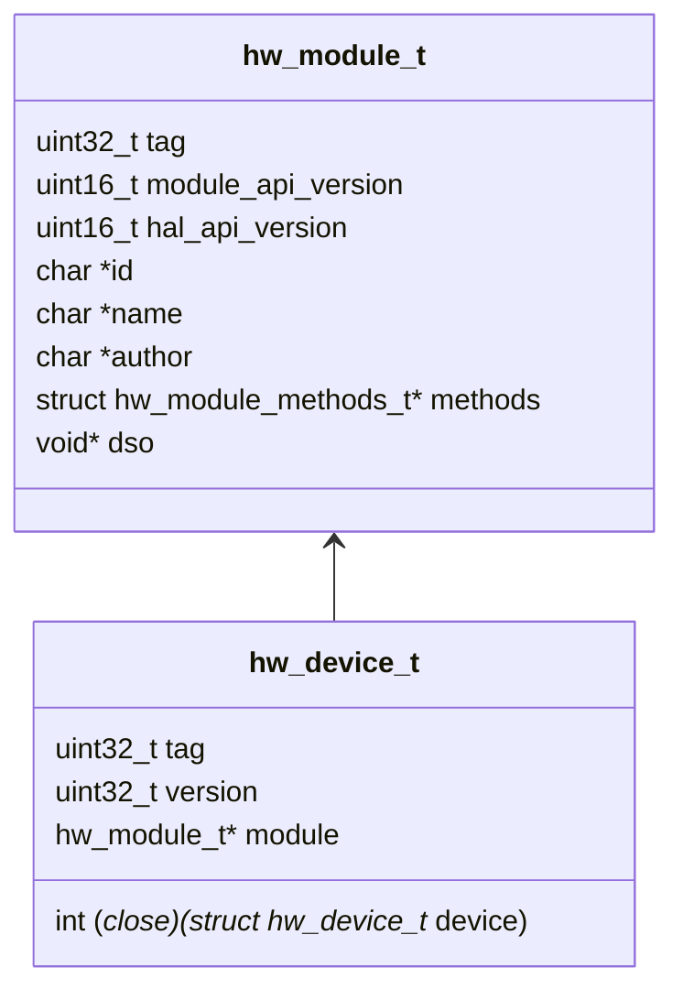
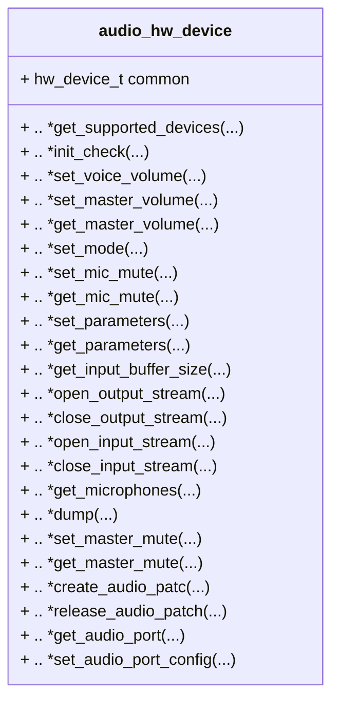
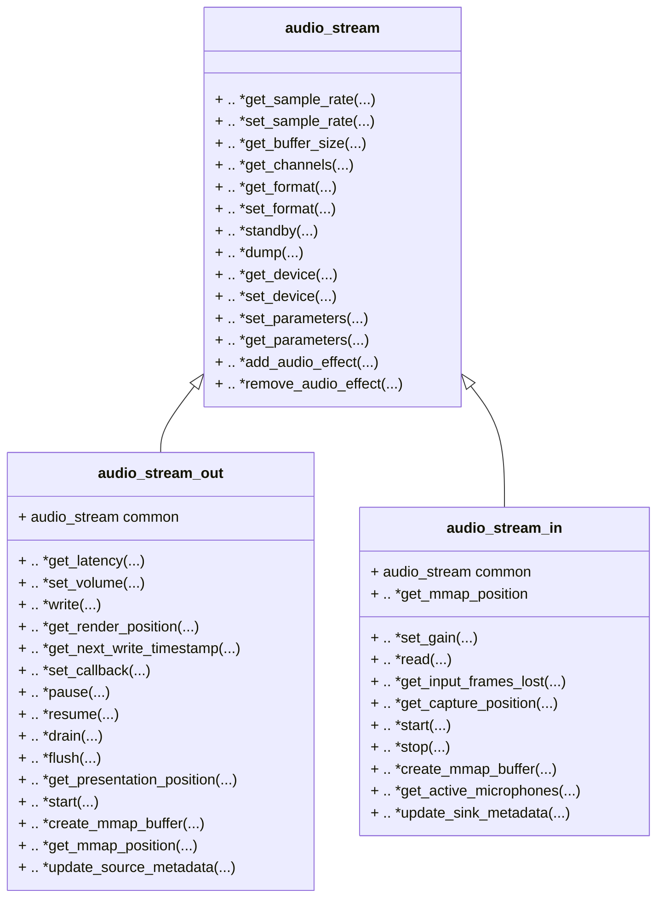
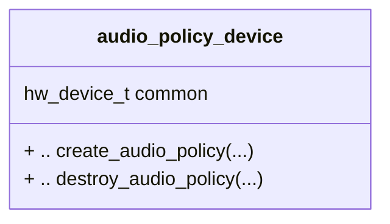
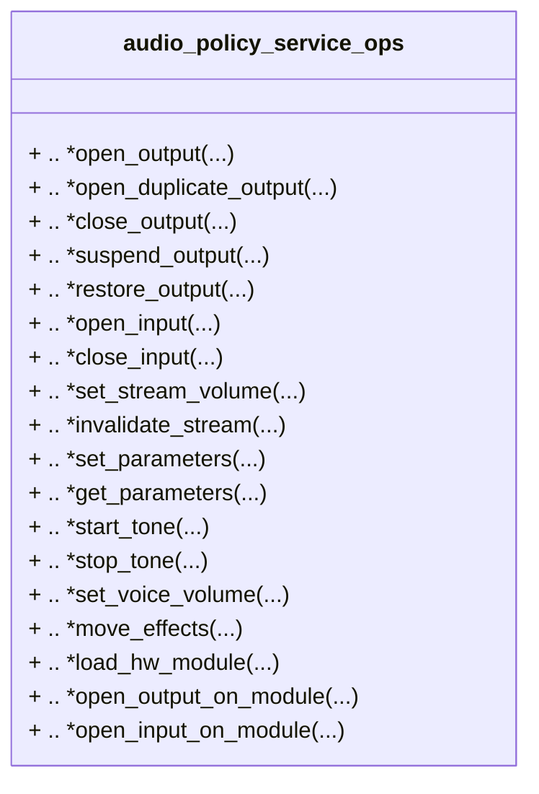
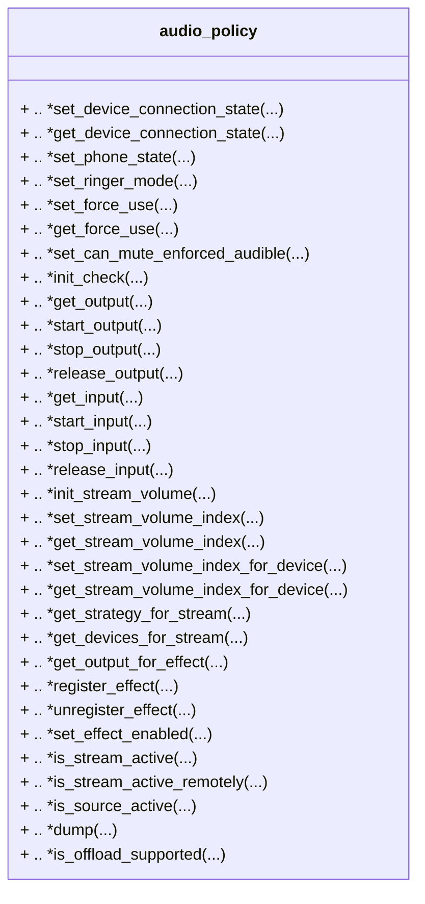
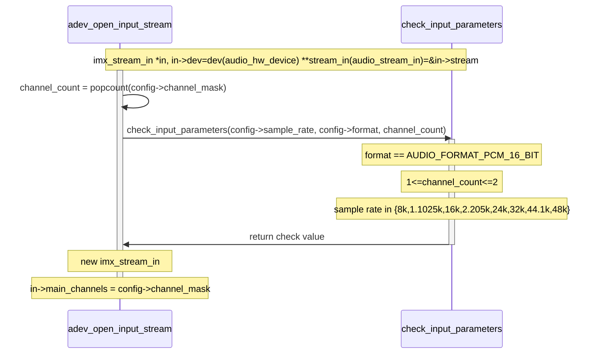
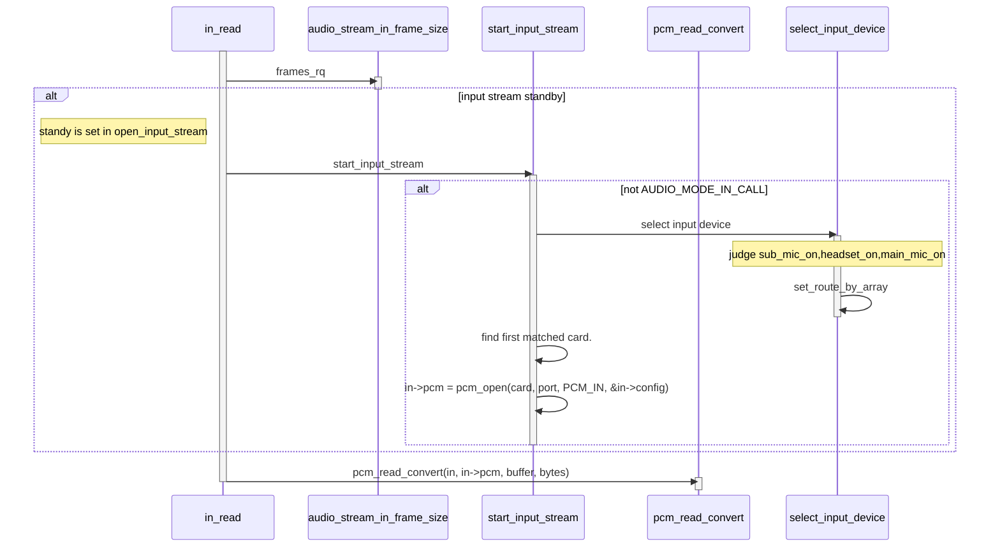

# Android Audio HAL

​	Android HAL在android 开发中占据着重要地位，尤其是android硬件厂商，与硬件相关的部分主要是：

- Linux driver
- Android HAL
- Tiny ALSA

​	由于一些开源代码协议的传染性，导致如果没有一层中间层代码，那么所有运用到开源驱动的Android相关的代码也将被迫开源。一方面为了解决开源证书的问题，另一方面为了统一底层提供给应用层的接口，Android引入了HAL层。

​	Android Audio HAL 本质上是满足android HAL接口要求的Tiny ALSA应用层中间接口。`HAL`+`Audio Flinger`+`Audio Policy Service`+`Audio Track`+`Audio Recorder`组成了整个完整的`Tiny ALSA`应用接口。

由于HAL承上启下的作用，本章主要详细介绍Android Audio HAL。


## Android Audio HAL 组件

​		由于Android是个复杂环境，音频的音源类别有所不同（铃声、电话、音乐、提示音），而音频的播放设备也有所不同（内置喇叭、蓝牙耳机、3.5mm耳机接口）。所以音频子系统，将播放的需求分为两部分：

1. 用何种音频播放设备，各种播放设备的音频数据关系
2. 如何设置对应某个播放设备的状态

​	由于需要解决上述的音频的策略和执行两部分，并且在HAL层均为其预备了两个hw_module（default 源码位于hardware/libhardware/audio) ，其MODULE_ID 分别为：

- AUDIO_POLICY_HARDWARE_MODULE_ID

- AUDIO_HARDWARE_MODULE_ID

  下面将从HAL展开，进而对Hardware Module与Policy Module进行介绍。


### HAL

HAL层的数据结构，通常都是继承自`hw_module_t`和 `hw_device_t`，其关系如下图所示：



​	在`hw_module_t`中`hw_module_methods_t`目前其结构体中目前只有一个函数指针`open`，其作用为初始化`hw_device_t`，并且将`hw_device_t`与`hw_module_t`相关联，`hw_module_methods_t`是`hw_module_t`的主要数据结构。

```c
typedef struct hw_module_methods_t {
    /** Open a specific device */
    int (*open)(const struct hw_module_t* module, const char* id,
            struct hw_device_t** device);
} hw_module_methods_t;
```

​	其他的所有HAL元素包括下文中的Hardware Module和Policy Module，均派生自这两个基本数据结构。由于此部分都是以c语言为主，所以继承关系用结构体包含来实现，要求派生的数据类型，第一个元素必须是继承的元素，以保证指针强转的正确性。HAL层中很多都是这样的强行规定，主要是为了HAL层接口函数的统一。


### Hardware Module (HAL)

​	此层顾名思义，主要涉及与硬件强相关的HAL部分。通常来说hardware module中主要涉及对两种数据类型的操作，一类是`audio_hw_device`，一类是`audio_stream`，分别对应为device和device的操作对象。

​	

#### audio_hw_device

​	`audio_hw_device`的主要数据结构如下图所示，其中需要继承并且实现的函数指针主要涉及设备的打开、查询、设置设备状态等。




#### audio_stream	

​	对于audio部分来说，针对audio的主要数据结构基础类是`audio_stream`，对于播放和录音流分别派生了`audio_stream_out`和`audio_stream_in`两个数据类型，其中需要继承并且实现的函数指针主要涉及采样率、数据格式、音效等的设置。



#### 	adev_open_output_stream

​	封装后的Hardware Module HAL对Linux Kernel的操作主要涉及stream的操作，以imx8mm板子为例（vendor/nxp-opensource/imx/alsa/tinyalsa_hal.c），其open stream函数如下，该函数主要：

- 创建了stream_out的结构体，分配了内存。
- 根据传入的flag，对stream_out进行初始化，制定了上述stream所需要的函数指针。
- 将创建的stream放入device对应的位置。

```c
static int adev_open_output_stream(struct audio_hw_device *dev,
                                   audio_io_handle_t handle __unused,
                                   audio_devices_t devices,
                                   audio_output_flags_t flags,
                                   struct audio_config *config,
                                   struct audio_stream_out **stream_out,
                                   const char* address){
  struct imx_audio_device *ladev = (struct imx_audio_device *)dev;
  struct imx_stream_out *out;
  out = (struct imx_stream_out *)calloc(1, sizeof(struct imx_stream_out));
  if (flags & AUDIO_OUTPUT_FLAG_COMPRESS_OFFLOAD) {
  	...
  }else if(flags & AUDIO_OUTPUT_FLAG_DIRECT && 
           devices == AUDIO_DEVICE_OUT_AUX_DIGITAL){
    ...
  }else{
    if (ladev->active_output[OUTPUT_PRIMARY] != NULL) { //type imx_stream_out
            if (flags & AUDIO_OUTPUT_FLAG_PRIMARY) {
                ret = -ENOSYS;
                goto err_open;
            } else {
                ALOGW("%s: already has primary output: %p", __func__,ladev>active_output[OUTPUT_PRIMARY]);
            }
        }
    output_type = OUTPUT_PRIMARY;
    pcm_type = PCM_NORMAL;
    out->stream.common.get_buffer_size = out_get_buffer_size_primary;
    out->stream.common.get_sample_rate = out_get_sample_rate;
    out->stream.get_latency = out_get_latency_primary;
    out->stream.write = out_write_primary;
    out->stream.common.set_sample_rate  = out_set_sample_rate;
    out->stream.common.get_channels     = out_get_channels;
    out->stream.common.get_format       = out_get_format;
    out->stream.common.set_format       = out_set_format;
    out->stream.common.standby          = out_standby;
    out->stream.common.dump             = out_dump;
    out->stream.common.set_parameters   = out_set_parameters;
    out->stream.common.get_parameters   = out_get_parameters;
    out->stream.common.add_audio_effect = out_add_audio_effect;
    out->stream.common.remove_audio_effect  = out_remove_audio_effect;
    out->stream.set_volume                  = out_set_volume;
    out->stream.get_render_position         = out_get_render_position;
    out->stream.get_presentation_position   = out_get_presentation_position;
    out->dev = ladev;
    out->standby = 1;
    out->device = devices;
    out->paused = false;
    out->pcm_type = pcm_type;   
    *stream_out = &out->stream;
    ladev->active_output[output_type] = out;
  }
}
```

#### out->stream.write = out_write_primary

out是stream_out中一个重要的函数，其在imx8mm板中Hal层实现如下，此函数主要：

- 对函数主体上锁
- 初始化stream_out结构体（start_output_stream_primary）
  - 打开对应card的操作即在此函数中（Use The Source, Luke）
  - 利用上述open函数获得的pcm指针，进行alsa驱动写操作

```c
static ssize_t out_write_primary(struct audio_stream_out *stream, const void* buffer,
                         size_t bytes)
{
    struct imx_stream_out *out = (struct imx_stream_out *)stream;
    struct imx_audio_device *adev = out->dev;
    size_t frame_size = audio_stream_out_frame_size((const struct audio_stream_out *)&out->stream.common);
    size_t in_frames = bytes / frame_size;
    size_t out_frames = in_frames;
    bool force_input_standby = false;
    struct imx_stream_in *in;
    int i;
    /* acquiring hw device mutex systematically is useful if a low priority thread is waiting
     * on the output stream mutex - e.g. executing select_mode() while holding the hw device
     * mutex
     */
    pthread_mutex_lock(&adev->lock);
    pthread_mutex_lock(&out->lock);

    if(adev->b_sco_rx_running)
        ALOGW("out_write_primary, bt receive task is running");
    if (out->standby) {
        ret = start_output_stream_primary(out);
        if (ret != 0) {
            pthread_mutex_unlock(&adev->lock);
            goto exit;
        }
        out->standby = 0;
        /* a change in output device may change the microphone selection */
        if (adev->active_input &&
                adev->active_input->source == AUDIO_SOURCE_VOICE_COMMUNICATION)
            force_input_standby = true;
    }
    pthread_mutex_unlock(&adev->lock);
    /* do not allow more than out->write_threshold frames in kernel pcm driver buffer */
    /* Write to all active PCMs */
    for (i = 0; i < PCM_TOTAL; i++) {
        if (out->pcm[i]) {
            if (out->config[i].rate == adev->default_rate) {
                /* PCM uses native sample rate */
                ret = pcm_write_wrapper(out->pcm[i], (void *)buffer, bytes, out->write_flags[i]);
            } else {
                /* PCM needs resampler */
                ret = pcm_write_wrapper(out->pcm[i], (void *)out->buffer, out_frames * frame_size, out->write_flags[i]);
            }

            if (ret) {
                out->writeContiFailCount[i]++;
                break;
            } else {
                out->writeContiFailCount[i] = 0;
            }
        }
   }
```


### Policy Module (HAL)

  音频策略的实现，有相当一部分的工作也需要通过操作硬件完成。通常来说Policy Module中同样主要涉及对两种数据类型的操作，一类是设备，一类是设备操作的数据类型。在Policy Module中主要为`audio_policy_device`与`audio_policy`。


#### audio_policy_device

​	`audio_policy_device`的数据结构如下图所示，主要涉及主体结构`audio_policy`的创建和销毁。


​	其中在`creat_audio_policy`函数中还涉及另一个结构体`audio_policy_service_ops`。

```c
int (*create_audio_policy)(const struct audio_policy_device *device,
                           struct audio_policy_service_ops *aps_ops,
                           void *service,
                           struct audio_policy **ap);
```

​	`audio_policy_service_ops`的结构体如下，其中主要包括设备的打开和关闭（此处与audio device进行对比）。
- audio device 的直接操作对象为stream。
- audio policy 的直接操作对象为audio device。



#### audio_policy

​	`audio_policy`的数据结构如下，其中包含许多与audio policy很多同名的函数。



​	总结一下，如果需要对audio设备进行HAL层的适配，那么主要涉及两个device的设置，配置其中的各个函数指针。

- audio device
  - 主要涉及stream的操作
  - Linux aSoC driver的调用
- audio policy device
  - 主要涉及device的启动
  - force use策略等


## Audio HAL 的内存初始化

​	通过上述的分析，两个HAL层的组件，均向下包含了，Linux ASoC驱动的读写策略。并且向上提供了Android HAL的统一读写接口，这一节主要讨论Audio HAL的载入。	

​	HAL层的函数编译完成后，都是生成一个形如：`audio.primary.so`这样的文件存在系统的文件系统中。当调用AudioFlinger的函数`loadHWModule`时，函数分析这个so文件中文件的**HAL_MODULE_INFO_SYM**（HMI）对应的数据结构，此结构即为:`audio_module`。

```c
struct audio_module HAL_MODULE_INFO_SYM = {
    .common = {
        .tag = HARDWARE_MODULE_TAG,
        .module_api_version = AUDIO_MODULE_API_VERSION_0_1,
        .hal_api_version = HARDWARE_HAL_API_VERSION,
        .id = AUDIO_HARDWARE_MODULE_ID,
        .name = "NXP i.MX Audio HW HAL",
        .author = "The Android Open Source Project",
        .methods = &hal_module_methods,
    },
};
```

​	而载入的文件名的解析，如`audio.primary.so`，`audio.usb.so`则是audio policy通过解析，`audio_policy_configuration.xml`来获得的。具体的分析将在AudioFlinger与Audio Policy中分析，概括来说，HAL层只需要根据Android HAL层的策略，对Linux Kernel层进行封装即可，具体的调用，则完全由它的调用层，AudioFlinger与Audio Policy决定。


### HAL start_input_stream





