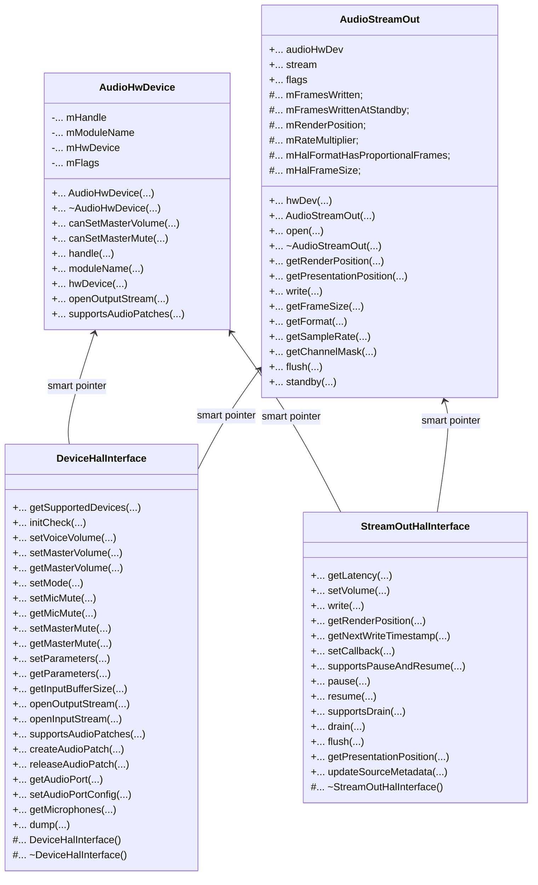
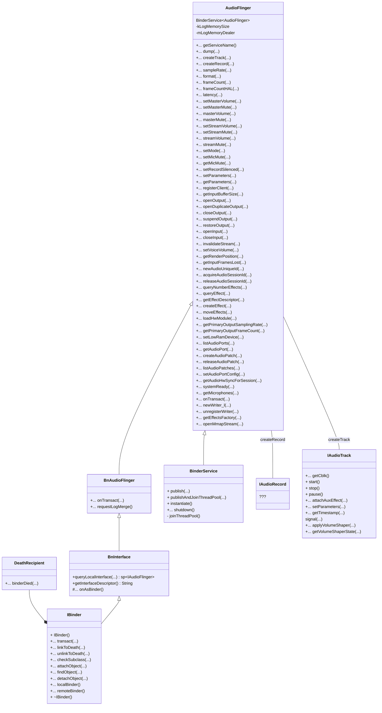
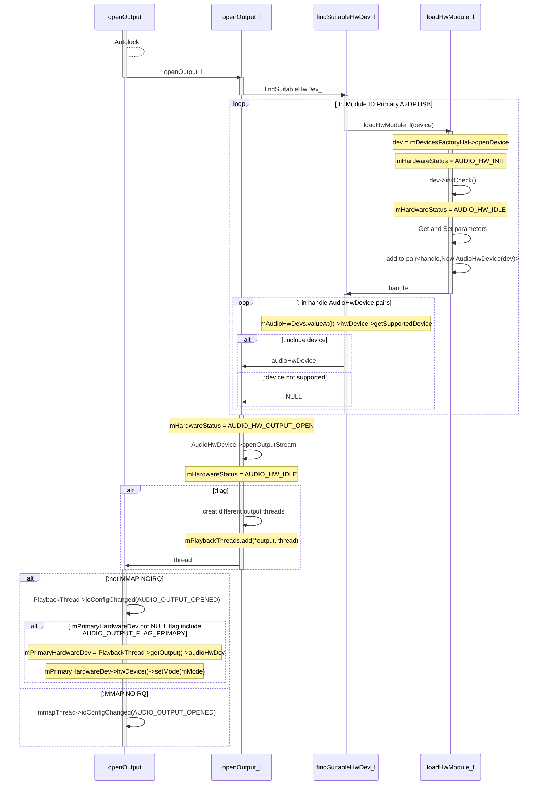
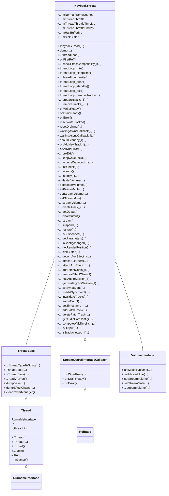

# AudioFlinger

​	Android Audio Flinger Service与Audio Policy Service是Android应用的基石，作为Media Server的一部分，对下调用Audio HAL层，完成对硬件的访问，对上，通过Binder IPC给Native Framework提供接口。

​	在Media Server层，Audio Flinger与Audio Policy并未完全解耦，所以需要分析AudioFlinger的整个流程需要结合Audio Policy一起分析。

​	另外，Audio Flinger通过`Binder`向上提供访问接口。`Binder`部分，会在Linux Binder驱动部分介绍。


## audioflinger

audioflinger为android framework的一部分，文件位于源码/framework/services/audioflinger中，主要包括：

- AudioFlinger/AudioHwDevice/AudioStreamOut
- AudioWatchDog
- Effects
- FastCapture
- FastMixer
- PatchPanel


### AudioHwDevice/AudioStreamOut

​	AudioFlinger.cpp是整个AudioFlinger service的核心，`AudioHwDevice`与`AudioStreamOut`这两个结构在Android Audio HAL中也存在，但名字为`audio_hardware_device`与`audio_stream_out`。这里是在android namespace下对上述的两个结构进行了类封装。主要的数据与函数如下所示：



​	其中`DeviceHalInterface`为Audio Device HAL的接口，其所有的虚函数均与HAL中`audio_device_t`相同;同样的`StreamOutHalInterface`为Stream Out HAL的接口，其所有的虚函数均与HAL中的`stream_out_t`相同。（/framework/av/media/libaudiohal/include/media/audiohal）

​	类比HAL层中，`audio_device_t`与`stream_out_t`两个结构体的函数指针，在`audio_device_t`中主要方法为`open_output_stream`与`open_input_stream`，而`stream_out_t`的方法为`out`。

​	在HAL层中，device 的`open_output`、`open_input`方法在`audio_policy`中，而`audio_device`主要负责stream的open，即`open_output_stream`与`open_input_stream`。audio flinger中的接口类中的实现也基本相同，`AudioHwDevice`除了保留`DeviceHalInterface`指针中的`open_output_stream`外，类中也包含了同名函数。

```c
status_t AudioHwDevice::openOutputStream(
        AudioStreamOut **ppStreamOut,
        audio_io_handle_t handle,
        audio_devices_t devices,
        audio_output_flags_t flags,
        struct audio_config *config,
        const char *address)
{

    struct audio_config originalConfig = *config;
    AudioStreamOut *outputStream = new AudioStreamOut(this, flags);
    status_t status = outputStream->open(handle, devices, config, address);
  	...
    *ppStreamOut = outputStream;
    return status;
}

```

​	`AudioStreamOut`中的out函数为audioflinger层才加入的函数，主要为根据传入的参数，回调`AudioHwDevice`中的`openOutputStream`方法。

```c++
status_t AudioStreamOut::open(
        audio_io_handle_t handle,
        audio_devices_t devices,
        struct audio_config *config,
        const char *address)
{
    sp<StreamOutHalInterface> outStream;

    audio_output_flags_t customFlags = (config->format == AUDIO_FORMAT_IEC61937)
                ? (audio_output_flags_t)(flags | AUDIO_OUTPUT_FLAG_IEC958_NONAUDIO)
                : flags;

    int status = hwDev()->openOutputStream(
            handle,
            devices,
            customFlags,
            config,
            address,
            &outStream);
}
```


### AudioFlinger

​	AudioFlinger作为android底层server组件，通过binder为client组件提供访问，AudioFlinge公有继承自`BnAudioFlinger`与`BinderService`，其中`BinderService`为模版类。


#### BnAudioFlinger

```c++
class BnAudioFlinger : public BnInterface<IAudioFlinger>
{
public:
    virtual status_t    onTransact( uint32_t code,
                                    const Parcel& data,
                                    Parcel* reply,
                                    uint32_t flags = 0);
    virtual void requestLogMerge() = 0;
};

template<typename INTERFACE>
class BnInterface : public INTERFACE, public BBinder
{
public:
    virtual sp<IInterface>      queryLocalInterface(const String16& _descriptor);
    virtual const String16&     getInterfaceDescriptor() const;

protected:
    virtual IBinder*            onAsBinder();
};
```


#### BinderService	

```c++
template<typename SERVICE>
class BinderService
{
public:
    static status_t publish(bool allowIsolated = false,
                            int dumpFlags = IServiceManager::DUMP_FLAG_PRIORITY_DEFAULT) {
        sp<IServiceManager> sm(defaultServiceManager());
        return sm->addService(String16(SERVICE::getServiceName()), new SERVICE(), allowIsolated,
                              dumpFlags);
    }
    static void publishAndJoinThreadPool(
            bool allowIsolated = false,
            int dumpFlags = IServiceManager::DUMP_FLAG_PRIORITY_DEFAULT) {
        publish(allowIsolated, dumpFlags);
        joinThreadPool();
    }
    static void instantiate() { publish(); }
    static status_t shutdown() { return NO_ERROR; }
private:
    static void joinThreadPool() {
        sp<ProcessState> ps(ProcessState::self());
        ps->startThreadPool();
        ps->giveThreadPoolName();
        IPCThreadState::self()->joinThreadPool();
    }
};
```

​	AudioFlinger的类图如下所示，由于AudioFlinger继承自BinderService，所以在调用publish函数时，将在servicemanager中创建名为audioflinger的系统服务。



### Audio Flinger的初始化

​	下为AudioFlinger的构造函数，可以看到，其基本上都是成员函数的初始化。其中：

- `BnAudioFlinger`构造函数为AudioFlinger父类缺省构造函数
- `mDevicesFactoryHal`初始化了Device的工厂方法，后续可以调用其`openDevice`方法
- `mEffectsFactoryHal`初始化了Effect的工厂方法，后续可以调用其`creatEffect`、`queryAllDescriptors`方等effect相关方法。

```c++
AudioFlinger::AudioFlinger()
    : BnAudioFlinger(),
      mMediaLogNotifier(new AudioFlinger::MediaLogNotifier()),
      mPrimaryHardwareDev(NULL),
      mAudioHwDevs(NULL),
      mHardwareStatus(AUDIO_HW_IDLE),
      mMasterVolume(1.0f),
      mMasterMute(false),
      // mNextUniqueId(AUDIO_UNIQUE_ID_USE_MAX),
      mMode(AUDIO_MODE_INVALID),
      mBtNrecIsOff(false),
      mIsLowRamDevice(true),
      mIsDeviceTypeKnown(false),
      mTotalMemory(0),
      mClientSharedHeapSize(kMinimumClientSharedHeapSizeBytes),
      mGlobalEffectEnableTime(0),
      mSystemReady(false)
{

    for (unsigned use = AUDIO_UNIQUE_ID_USE_UNSPECIFIED; use < AUDIO_UNIQUE_ID_USE_MAX; use++) {
        mNextUniqueIds[use] = AUDIO_UNIQUE_ID_USE_MAX;
    }
    getpid_cached = getpid();
    const bool doLog = property_get_bool("ro.test_harness", false);
    if (doLog) {
        mLogMemoryDealer = new MemoryDealer(kLogMemorySize, "LogWriters",
                MemoryHeapBase::READ_ONLY);
        (void) pthread_once(&sMediaLogOnce, sMediaLogInit);
    }

    BatteryNotifier::getInstance().noteResetAudio();
    mDevicesFactoryHal = DevicesFactoryHalInterface::create();
    mEffectsFactoryHal = EffectsFactoryHalInterface::create();
    mMediaLogNotifier->run("MediaLogNotifier");
```

​	许多函数的初始都放在sp的`onFirstRf`中，但AudioFlinger的`onFirstRef`函数并非如此，其与上面的构造函数一样，也是进行了常规的初始化操作。(注意到源码备注：move all this work into an Init() function)

```c++
void AudioFlinger::onFirstRef()
{
    Mutex::Autolock _l(mLock);
    /* TODO: move all this work into an Init() function */
    char val_str[PROPERTY_VALUE_MAX] = { 0 };
    if (property_get("ro.audio.flinger_standbytime_ms", val_str, NULL) >= 0) {
        uint32_t int_val;
        if (1 == sscanf(val_str, "%u", &int_val)) {
            mStandbyTimeInNsecs = milliseconds(int_val);
            ALOGI("Using %u mSec as standby time.", int_val);
        } else {
            mStandbyTimeInNsecs = kDefaultStandbyTimeInNsecs;
            ALOGI("Using default %u mSec as standby time.",
                    (uint32_t)(mStandbyTimeInNsecs / 1000000));
        }
    }
    mPatchPanel = new PatchPanel(this);
    mMode = AUDIO_MODE_NORMAL;
    gAudioFlinger = this;
}
```


### AudioFlinger::openOutput              



### AudioFlinger::mPlaybackThread

​	上述`openOutput`函数运行后，直接的结果为创建了一个`PlaybackThread`对象（`MixerThread`或DirectOutputThread），该对象最终被添加到`mPlaybackThreads`(<audio_io_handle_t,sp<PlaybackThread>>)中。

​	PlaybackTread的数据结构如下所示，playbackThread或者captureThread，是整个AudioFlinger操作的主体，也是平常的DSP Audio的主体线程。观察其主要的方法：

- 主体循环为`threadLoop`
- 属性主体：
  - Effect
  - syncEvents
  - addTracks



​	`PlaybackThread`继承了`RefBase`，所以虽然在`AudioFlinger`中没有进行函数调用，再其第一次引用时触发函数：

```c++
void AudioFlinger::PlaybackThread::onFirstRef()
{
    run(mThreadName, ANDROID_PRIORITY_URGENT_AUDIO);
}
```

`run`函数的实现在system\core\libutils\Threads.cpp中，最终调用自身实例中的treadLoop()函数。

```c++
status_t Thread::run(const char* name, int32_t priority, size_t stack)
{
		...
    if (mCanCallJava) {
        res = createThreadEtc(_threadLoop,
                this, name, priority, stack, &mThread);
    } else {
        res = androidCreateRawThreadEtc(_threadLoop,
                this, name, priority, stack, &mThread);
    }
    ...
    return NO_ERROR;
 
int androidCreateRawThreadEtc(android_thread_func_t entryFunction,
                               void *userData,
                               const char* threadName __android_unused,
                               int32_t threadPriority,
                               size_t threadStackSize,
                               android_thread_id_t *threadId)
{
		...
    int result = pthread_create(&thread, &attr,
                    (android_pthread_entry)entryFunction, userData);
    ...
}
  
  int Thread::_threadLoop(void* user)
{

    ...
     result = self->threadLoop();
    ...
    return 0;
}
```

​	`threadLoop`函数是整个thread的主体，也是整个音频循环的主体，其主循环为：

```c++
while (!exitPending()){
  ... status check and handling
  mMixerStatus = prepareTracks_l(&tracksToRemove); //对tracks进行判断，删除不需要的tracks
  lockEffectChains_l(effectChains);
  ... //effect related stuff
   unlockEffectChains
   if (!waitingAsyncCallback()) {
     if (mBytesRemaining) {
       	mLastWriteTime = systemTime();  // also used for dumpsys
				ret = threadLoop_write();
				lastWriteFinished = systemTime();
				delta = lastWriteFinished - mLastWriteTime;
				if (ret < 0) {
					mBytesRemaining = 0;
				} else {
					mBytesWritten += ret;
					mBytesRemaining -= ret;
					mFramesWritten += ret / mFrameSize;
				}
		} else if ((mMixerStatus == MIXER_DRAIN_TRACK) ||(mMixerStatus == MIXER_DRAIN_ALL)) {
				threadLoop_drain();
   }
}
```

​	`threadLoop_write`中主要函数为：

```c++
bytesWritten = mOutput->write((char *)mSinkBuffer + offset, mBytesRemaining);
```

​	`mOutput` 为PlaybackThread中的`AudioStreamOut`指针。


### AudioFlinger::createTrack

​	在前面的章节中，openOutput`在audioFlinger`初始化后，进行了HAL层的初始化，并且初始化了其主要的结构体：playback或capture。

​	但是playbackThread或者caputureThread的主要操作对象均为track。createTrack是一个IAudioFlinger 接口函数。放在binder接口中分析。

