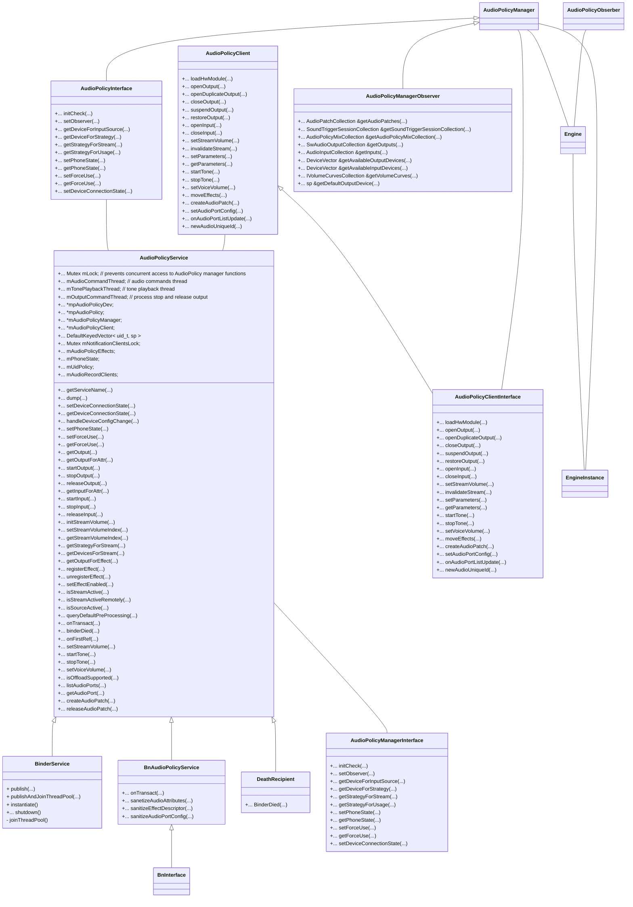
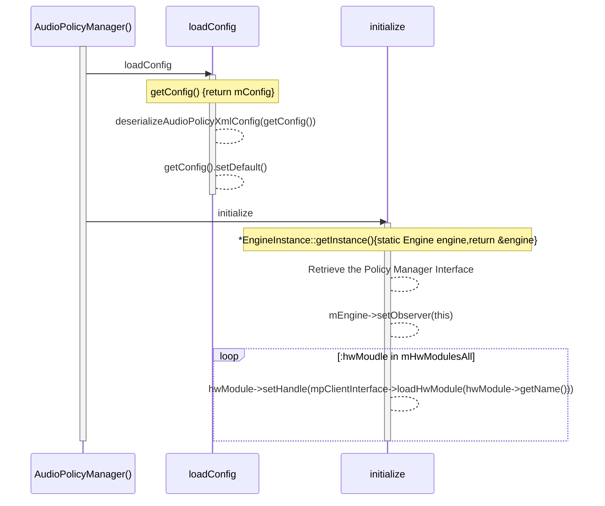

# AudioPolicy

​	在AudioFlinger的分析中，其主要的初始化是在AudioFlinger的本地完成的，而`openOutput`函数却并非AudioFlinger本身调用，而是AudioPolicy调用的。作为Android Audio 的两大组件之一，与HAL层的policy与device的功能类似，AudioPolicy主要决定了Audio设备的打开，音源切换等。

​	

## AudioPolicyService

​	`AudioPolicyService`与`AudioFlinger`都是在main_mediaserver中调用`instaniate()`方法进行实例化，并且由于两者都继承自RefBase，均会在`onFirstRef`中执行真正的初始化。

​	*AudioPolicy与AudioFlinger都是service但是，只有AudioPolicy有service后缀*

AudioPolicyService的数据结构如下所示，与HAL层的AudioPolicy对应，AudioPolicyService主要涉及output、input、effect的打开关闭，音量设置等。



## AudioPolicyService的初始化

​	此文只分析AudioPolicyService的初始化，后续的具体功能分析结合binder与native层函数一起分析。AudioPolicyService的初始化只初始化了部分函数成员，做赋值操作。真正的初始化在OnFirstRef中，如下

```c++
void AudioPolicyService::onFirstRef()
{
    {
        Mutex::Autolock _l(mLock);

        // start tone playback thread
        mTonePlaybackThread = new AudioCommandThread(String8("ApmTone"), this);
        // start audio commands thread
        mAudioCommandThread = new AudioCommandThread(String8("ApmAudio"), this);
        // start output activity command thread
        mOutputCommandThread = new AudioCommandThread(String8("ApmOutput"), this);

        mAudioPolicyClient = new AudioPolicyClient(this);
        mAudioPolicyManager = createAudioPolicyManager(mAudioPolicyClient);
    }
    // load audio processing modules
    sp<AudioPolicyEffects>audioPolicyEffects = new AudioPolicyEffects();
    {
        Mutex::Autolock _l(mLock);
        mAudioPolicyEffects = audioPolicyEffects;
    }

    mUidPolicy = new UidPolicy(this);
    mUidPolicy->registerSelf();
}
```

AudioPolicy创建了三个线程：

- tone playback thread

- audio command thread

- outputcommand thread

	随后创建了。`AudioPolicyClient`成员与`AudioPolicyManager`成员。

```c++
AudioPolicyService::AudioPolicyService()
    : BnAudioPolicyService(), mpAudioPolicyDev(NULL), mpAudioPolicy(NULL),
      mAudioPolicyManager(NULL), mAudioPolicyClient(NULL), mPhoneState(AUDIO_MODE_INVALID)
```

AudioPolicyManager初始化过程如下：



​	从上面的流程图可以看出，其中涉及到了AudioPolicyManager与Engine、Engine instance等类，与AudioFlinger不相同。目测AudioFlinger将迎来一次整合。

​	

​		

