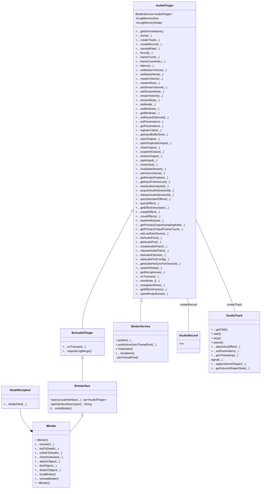
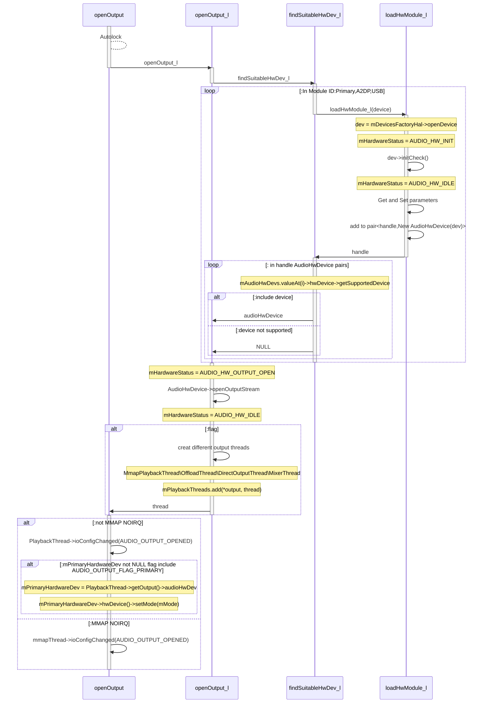
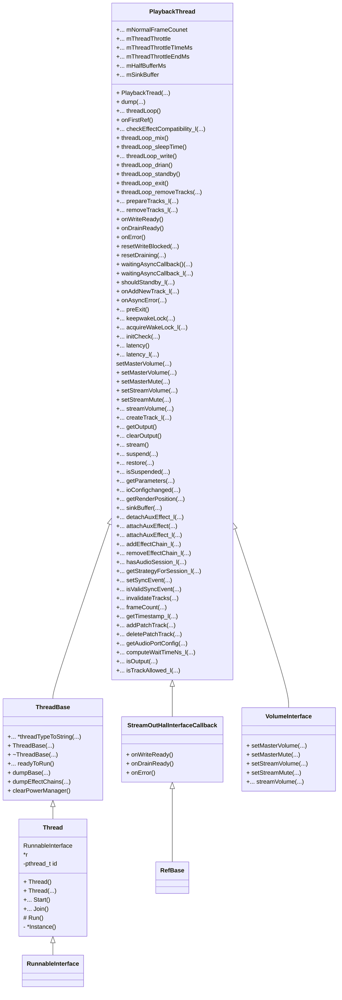

# AudioFlinger

​	`Audio Flinger Service`与`Audio Policy Service`是android audio的基石，作为`Media Server`的一部分，AF与AP对下调用Audio HAL层，完成对硬件的访问，对上，通过Binder IPC给Native Framework提供接口。在`Media Server`层，AF与APolicy虽然解耦，但是对于audio这个功能而言，却还是需要两个组件共同作用才能完成。此小章主要介绍AF。

## audioflinger

`audioflinger`为android framework的一部分，文件位于源码`/framework/services/audioflinger`中，主要包括：

- AudioFlinger.cpp（audio flinger的主文件）
- Threads.cpp (audio flinger主要最终需要创建一个个回放或采集的子线程)
- Tracks.cpp (audio flinger主要针对的结构体对象)

在`Android P` 的audioflinger源码文件夹中，已经将`AudioStreamOut`分离为单独的文件头与cpp文件，而AudioStreamIn仍然在audioflinger的文件中。在可以预见的将来，Android 必然将AudioStreamIn也同样分离出来。

### AudioFlinger

​	AudioFlinger作为android底层server组件，通过binder为client组件提供访问，AudioFlinge公有继承自`BnAudioFlinger`与`BinderService`，其中`BinderService`为模版类。

#### BnAudioFlinger

```c++
class BnAudioFlinger : public BnInterface<IAudioFlinger>
{
public:
    virtual status_t    onTransact( uint32_t code,
                                    const Parcel& data,
                                    Parcel* reply,
                                    uint32_t flags = 0);
    virtual void requestLogMerge() = 0;
};

template<typename INTERFACE>
class BnInterface : public INTERFACE, public BBinder
{
public:
    virtual sp<IInterface>      queryLocalInterface(const String16& _descriptor);
    virtual const String16&     getInterfaceDescriptor() const;

protected:
    virtual IBinder*            onAsBinder();
};
```

#### BinderService	

```c++
template<typename SERVICE>
class BinderService
{
public:
    static status_t publish(bool allowIsolated = false,
                            int dumpFlags = IServiceManager::DUMP_FLAG_PRIORITY_DEFAULT) {
        sp<IServiceManager> sm(defaultServiceManager());
        return sm->addService(String16(SERVICE::getServiceName()), new SERVICE(), allowIsolated,
                              dumpFlags);
    }
    static void publishAndJoinThreadPool(
            bool allowIsolated = false,
            int dumpFlags = IServiceManager::DUMP_FLAG_PRIORITY_DEFAULT) {
        publish(allowIsolated, dumpFlags);
        joinThreadPool();
    }
    static void instantiate() { publish(); }
    static status_t shutdown() { return NO_ERROR; }
private:
    static void joinThreadPool() {
        sp<ProcessState> ps(ProcessState::self());
        ps->startThreadPool();
        ps->giveThreadPoolName();
        IPCThreadState::self()->joinThreadPool();
    }
};
```

​	AudioFlinger的类图如下所示，由于AudioFlinger继承自BinderService，所以在调用publish函数时，将在servicemanager中创建名为audioflinger的系统服务。



## audio flinger的初始化

​	下为AudioFlinger的构造函数，可以看到，其基本上都是成员函数的初始化。其中：

- `BnAudioFlinger`构造函数为AudioFlinger父类缺省构造函数
- `mDevicesFactoryHal`初始化了Device的工厂方法，后续可以调用其`openDevice`方法
- `mEffectsFactoryHal`初始化了Effect的工厂方法，后续可以调用其`creatEffect`、`queryAllDescriptors`方等effect相关方法。

```c++
AudioFlinger::AudioFlinger()
    : BnAudioFlinger(),
      mMediaLogNotifier(new AudioFlinger::MediaLogNotifier()),
      mPrimaryHardwareDev(NULL),
      mAudioHwDevs(NULL),
      mHardwareStatus(AUDIO_HW_IDLE),
      mMasterVolume(1.0f),
      mMasterMute(false),
      // mNextUniqueId(AUDIO_UNIQUE_ID_USE_MAX),
      mMode(AUDIO_MODE_INVALID),
      mBtNrecIsOff(false),
      mIsLowRamDevice(true),
      mIsDeviceTypeKnown(false),
      mTotalMemory(0),
      mClientSharedHeapSize(kMinimumClientSharedHeapSizeBytes),
      mGlobalEffectEnableTime(0),
      mSystemReady(false)
{

    for (unsigned use = AUDIO_UNIQUE_ID_USE_UNSPECIFIED; use < AUDIO_UNIQUE_ID_USE_MAX; use++) {
        mNextUniqueIds[use] = AUDIO_UNIQUE_ID_USE_MAX;
    }
    getpid_cached = getpid();
    const bool doLog = property_get_bool("ro.test_harness", false);
    if (doLog) {
        mLogMemoryDealer = new MemoryDealer(kLogMemorySize, "LogWriters",
                MemoryHeapBase::READ_ONLY);
        (void) pthread_once(&sMediaLogOnce, sMediaLogInit);
    }

    BatteryNotifier::getInstance().noteResetAudio();
    mDevicesFactoryHal = DevicesFactoryHalInterface::create();
    mEffectsFactoryHal = EffectsFactoryHalInterface::create();
    mMediaLogNotifier->run("MediaLogNotifier");
```

​	许多函数的初始都放在sp的`onFirstRf`中，但AudioFlinger的`onFirstRef`函数并非如此，其与上面的构造函数一样，也是进行了常规的初始化操作。(注意到源码备注：move all this work into an Init() function)

```c++
void AudioFlinger::onFirstRef()
{
    Mutex::Autolock _l(mLock);
    /* TODO: move all this work into an Init() function */
    char val_str[PROPERTY_VALUE_MAX] = { 0 };
    if (property_get("ro.audio.flinger_standbytime_ms", val_str, NULL) >= 0) {
        uint32_t int_val;
        if (1 == sscanf(val_str, "%u", &int_val)) {
            mStandbyTimeInNsecs = milliseconds(int_val);
            ALOGI("Using %u mSec as standby time.", int_val);
        } else {
            mStandbyTimeInNsecs = kDefaultStandbyTimeInNsecs;
            ALOGI("Using default %u mSec as standby time.",
                    (uint32_t)(mStandbyTimeInNsecs / 1000000));
        }
    }
    mPatchPanel = new PatchPanel(this);
    mMode = AUDIO_MODE_NORMAL;
    gAudioFlinger = this;
}
```


## audioflinger::openOutput              




## audioflinger::mPlaybackThread

​	上述`openOutput`函数运行后，直接的结果为创建了一个`PlaybackThread`对象（`MixerThread`或DirectOutputThread），该对象最终被添加到`mPlaybackThreads`(<audio_io_handle_t,sp<PlaybackThread>>)中。

​	PlaybackTread的数据结构如下所示，playbackThread或者captureThread，是整个AudioFlinger操作的主体，也是平常的DSP Audio的主体线程。观察其主要的方法：

- 主体循环为`threadLoop`
- 属性主体：
  - Effect
  - syncEvents
  - addTracks



​	`PlaybackThread`继承了`RefBase`，所以虽然在`AudioFlinger`中没有进行函数调用，再其第一次引用时触发函数：

```c++
void AudioFlinger::PlaybackThread::onFirstRef()
{
    run(mThreadName, ANDROID_PRIORITY_URGENT_AUDIO);
}
```

`run`函数的实现在system\core\libutils\Threads.cpp中，最终调用自身实例中的treadLoop()函数。

```c++
status_t Thread::run(const char* name, int32_t priority, size_t stack)
{
		...
    if (mCanCallJava) {
        res = createThreadEtc(_threadLoop,
                this, name, priority, stack, &mThread);
    } else {
        res = androidCreateRawThreadEtc(_threadLoop,
                this, name, priority, stack, &mThread);
    }
    ...
    return NO_ERROR;
 
int androidCreateRawThreadEtc(android_thread_func_t entryFunction,
                               void *userData,
                               const char* threadName __android_unused,
                               int32_t threadPriority,
                               size_t threadStackSize,
                               android_thread_id_t *threadId)
{
		...
    int result = pthread_create(&thread, &attr,
                    (android_pthread_entry)entryFunction, userData);
    ...
}
  
  int Thread::_threadLoop(void* user)
{

    ...
     result = self->threadLoop();
    ...
    return 0;
}
```

​	`threadLoop`函数是整个thread的主体，也是整个音频循环的主体，其主循环为：

```c++
while (!exitPending()){
  ... status check and handling
  mMixerStatus = prepareTracks_l(&tracksToRemove); //mixthread 方法，对tracks进行判断，删除不需要的tracks
   if (mBytesRemaining == 0) {
            mCurrentWriteLength = 0;
            if (mMixerStatus == MIXER_TRACKS_READY) {
                // threadLoop_mix() sets mCurrentWriteLength
                threadLoop_mix();	//mix 混音
            }
   }
   lockEffectChains_l(effectChains);
  ... //effect related stuff
   unlockEffectChains
   if (!waitingAsyncCallback()) {
     if (mBytesRemaining) {
       	mLastWriteTime = systemTime();  // also used for dumpsys
				ret = threadLoop_write();
				lastWriteFinished = systemTime();
				delta = lastWriteFinished - mLastWriteTime;
				if (ret < 0) {
					mBytesRemaining = 0;
				} else {
					mBytesWritten += ret;
					mBytesRemaining -= ret;
					mFramesWritten += ret / mFrameSize;
				}
		} else if ((mMixerStatus == MIXER_DRAIN_TRACK) ||(mMixerStatus == MIXER_DRAIN_ALL)) {
				threadLoop_drain();
   }
}
```

**其中将所有track进行混音操作得是`audio mix	`,这是一个比较复杂的对象类型，感兴趣的可以自行从源码学习**，这是一个比较重要的结构体，用于mix所有的audio track对象。

在mix完成后，`threadLoop_write`中主要函数为：

```c++
bytesWritten = mOutput->write((char *)mSinkBuffer + offset, mBytesRemaining);
```

​	`mOutput` 为PlaybackThread中的`AudioStreamOut`指针。

```c++
ssize_t AudioStreamOut::write(const void *buffer, size_t numBytes)
{
    size_t bytesWritten;
    status_t result = stream->write(buffer, numBytes, &bytesWritten);
    if (result == OK && bytesWritten > 0 && mHalFrameSize > 0) {
        mFramesWritten += bytesWritten / mHalFrameSize;
    }
    return result == OK ? bytesWritten : result;
}
```

## audioflinger::createTrack

​	在前面的章节中，openOutput`在audioFlinger`初始化后，进行了HAL层的初始化，并且初始化了其主要的结构体：playback或capture。但playbackThread或者caputureThread的主要操作对象均为track。由于c或capture的操作互为镜像，此处仅分析`AudioFlinger::addTrack`的调用流程，`AudioFlinger::addRecord`同理可以分析。

```c
sp<IAudioTrack> AudioFlinger::createTrack(const CreateTrackInput& input,
                                          CreateTrackOutput& output,
                                          status_t *status)
{
    sp<PlaybackThread::Track> track;
    sp<TrackHandle> trackHandle;
    sp<Client> client;
    status_t lStatus;
    audio_stream_type_t streamType;
    audio_port_handle_t portId = AUDIO_PORT_HANDLE_NONE;

    bool updatePid = (input.clientInfo.clientPid == -1);
    const uid_t callingUid = IPCThreadState::self()->getCallingUid();
    uid_t clientUid = input.clientInfo.clientUid;
    if (!isTrustedCallingUid(callingUid)) {
        ALOGW_IF(clientUid != callingUid,
                "%s uid %d tried to pass itself off as %d",
                __FUNCTION__, callingUid, clientUid);
        clientUid = callingUid;
        updatePid = true;
    }
    pid_t clientPid = input.clientInfo.clientPid;
    if (updatePid) {
        const pid_t callingPid = IPCThreadState::self()->getCallingPid();
        ALOGW_IF(clientPid != -1 && clientPid != callingPid,
                 "%s uid %d pid %d tried to pass itself off as pid %d",
                 __func__, callingUid, callingPid, clientPid);
        clientPid = callingPid;
    }

    audio_session_t sessionId = input.sessionId;
    if (sessionId == AUDIO_SESSION_ALLOCATE) {
        sessionId = (audio_session_t) newAudioUniqueId(AUDIO_UNIQUE_ID_USE_SESSION);
    } else if (audio_unique_id_get_use(sessionId) != AUDIO_UNIQUE_ID_USE_SESSION) {
        lStatus = BAD_VALUE;
        goto Exit;
    }

    output.sessionId = sessionId;
    output.outputId = AUDIO_IO_HANDLE_NONE;
    output.selectedDeviceId = input.selectedDeviceId;

    // 1. 从audio_policy_config 中获取设置参数
    lStatus = AudioSystem::getOutputForAttr(&input.attr, &output.outputId, sessionId, &streamType,
                                            clientPid, clientUid, &input.config, input.flags,
                                            &output.selectedDeviceId, &portId);

    if (lStatus != NO_ERROR || output.outputId == AUDIO_IO_HANDLE_NONE) {
        ALOGE("createTrack() getOutputForAttr() return error %d or invalid output handle", lStatus);
        goto Exit;
    }

    if (uint32_t(streamType) >= AUDIO_STREAM_CNT) {
        ALOGE("createTrack() invalid stream type %d", streamType);
        lStatus = BAD_VALUE;
        goto Exit;
    }

    if (!audio_is_output_channel(input.config.channel_mask)) {
        ALOGE("createTrack() invalid channel mask %#x", input.config.channel_mask);
        lStatus = BAD_VALUE;
        goto Exit;
    }

    if (!audio_is_valid_format(input.config.format)) {
        ALOGE("createTrack() invalid format %#x", input.config.format);
        lStatus = BAD_VALUE;
        goto Exit;
    }

    {
        Mutex::Autolock _l(mLock);
        // 2.获得全局playback 线程
        PlaybackThread *thread = checkPlaybackThread_l(output.outputId); 
        if (thread == NULL) {
            ALOGE("no playback thread found for output handle %d", output.outputId);
            lStatus = BAD_VALUE;
            goto Exit;
        }

        client = registerPid(clientPid);

        PlaybackThread *effectThread = NULL;

        for (size_t i = 0; i < mPlaybackThreads.size(); i++) {
            sp<PlaybackThread> t = mPlaybackThreads.valueAt(i);
            if (mPlaybackThreads.keyAt(i) != output.outputId) {
                uint32_t sessions = t->hasAudioSession(sessionId);
                if (sessions & ThreadBase::EFFECT_SESSION) {
                    effectThread = t.get();
                    break;
                }
            }
        }
        ALOGV("createTrack() sessionId: %d", sessionId);

        output.sampleRate = input.config.sample_rate;
        output.frameCount = input.frameCount;
        output.notificationFrameCount = input.notificationFrameCount;
        output.flags = input.flags;

        // 3.创建重放track
        track = thread->createTrack_l(client, streamType, input.attr, &output.sampleRate,
                                      input.config.format, input.config.channel_mask,
                                      &output.frameCount, &output.notificationFrameCount,
                                      input.notificationsPerBuffer, input.speed,
                                      input.sharedBuffer, sessionId, &output.flags,
                                      input.clientInfo.clientTid, clientUid, &lStatus, portId);
        LOG_ALWAYS_FATAL_IF((lStatus == NO_ERROR) && (track == 0));

        output.afFrameCount = thread->frameCount();
        output.afSampleRate = thread->sampleRate();
        output.afLatencyMs = thread->latency();

 
        if (lStatus == NO_ERROR && effectThread != NULL) {
            Mutex::Autolock _dl(thread->mLock);
            Mutex::Autolock _sl(effectThread->mLock);
            moveEffectChain_l(sessionId, effectThread, thread, true);
        }

        for (size_t i = 0; i < mPendingSyncEvents.size(); i++) {
            if (mPendingSyncEvents[i]->triggerSession() == sessionId) {
                if (thread->isValidSyncEvent(mPendingSyncEvents[i])) {
                    if (lStatus == NO_ERROR) {
                        (void) track->setSyncEvent(mPendingSyncEvents[i]);
                    } else {
                        mPendingSyncEvents[i]->cancel();
                    }
                    mPendingSyncEvents.removeAt(i);
                    i--;
                }
            }
        }

        setAudioHwSyncForSession_l(thread, sessionId);
    }

    if (lStatus != NO_ERROR) {
  
            Mutex::Autolock _cl(mClientLock);
            client.clear();
        }
        track.clear();
        goto Exit;
    }

	// 4.创建 track 句柄
    trackHandle = new TrackHandle(track);

Exit:
    if (lStatus != NO_ERROR && output.outputId != AUDIO_IO_HANDLE_NONE) {
        AudioSystem::releaseOutput(output.outputId, streamType, sessionId);
    }
    *status = lStatus;
    return trackHandle;
}
```

上述代码主要进行了如下所述四个步骤，上述代码虽然看似只创建了一个track对象并且返回了其句柄，但实际上多个步骤具有side effect：

- 从audio_policy_config 中获取设置参数
  - 此步骤会在audio policy中搜索合适的参数，传入的构造参数仅为参考，会根据此步骤函数调用进行建议的修改（所以有时，设置8通道采集时，在此步将被强制修改回2通道）
- 获得全局playback 线程
- 创建重放track
  - 这里在返回track实例前，会将其放入到playback线程的对象中。后续在thread loop中不停的播放所有track对象的混音。
- 创建 track 句柄

