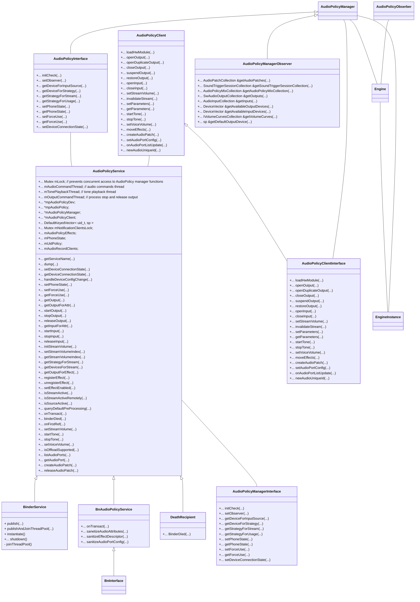
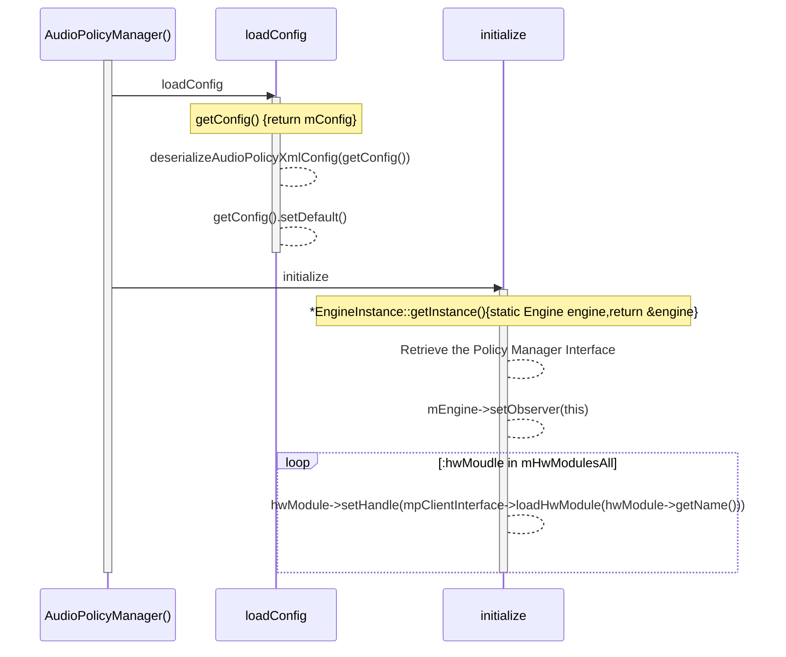

# AudioPolicy

`AudioPolicy service`与`Audio Flinger`是底层Audio server的两大组成部分。两者共同作用完成了Android音频的底层服务。与`AF`不同`AP`主要针对：

- 输入输出设备状态改变
- 系统音量策略

而`AF`则主要负责音频的具体工作，如，打开流、在流中增加音频`track`实体等。在`AF`的分析中，虽然其主要的初始化是在`AF`的本地完成的，但`openOutput`函数却并非`AF`本身调用，而是`AP`调用的。

## AudioPolicyService

​	`AudioPolicyService`与`AudioFlinger`都是在main_mediaserver中调用`instaniate()`方法进行实例化，并且由于两者都继承自RefBase，均在`onFirstRef`中执行真正的初始化。

​	*AudioPolicy与AudioFlinger都是service但是，只有AudioPolicy有service后缀*

AudioPolicyService的数据结构如下所示，与HAL层的AudioPolicy对应，AudioPolicyService主要涉及output、input、effect的打开关闭，音量设置等。



## AudioPolicyService的初始化

​	此文只分析AudioPolicyService的初始化，后续的具体功能分析结合binder与native层函数一起分析。AudioPolicyService的初始化只初始化了部分函数成员，做赋值操作。真正的初始化在OnFirstRef中，如下

```c++
void AudioPolicyService::onFirstRef()
{
    {
        Mutex::Autolock _l(mLock);

        // start tone playback thread
        mTonePlaybackThread = new AudioCommandThread(String8("ApmTone"), this);
        // start audio commands thread
        mAudioCommandThread = new AudioCommandThread(String8("ApmAudio"), this);
        // start output activity command thread
        mOutputCommandThread = new AudioCommandThread(String8("ApmOutput"), this);

        mAudioPolicyClient = new AudioPolicyClient(this);
        mAudioPolicyManager = createAudioPolicyManager(mAudioPolicyClient);
    }
    // load audio processing modules
    sp<AudioPolicyEffects>audioPolicyEffects = new AudioPolicyEffects();
    {
        Mutex::Autolock _l(mLock);
        mAudioPolicyEffects = audioPolicyEffects;
    }

    mUidPolicy = new UidPolicy(this);
    mUidPolicy->registerSelf();
}
```

AudioPolicy创建了三个线程：

- tone playback thread

- audio command thread

- outputcommand thread

   

  随后创建了。`AudioPolicyClient`成员与`AudioPolicyManager`成员。

```c++
AudioPolicyService::AudioPolicyService()
    : BnAudioPolicyService(), mpAudioPolicyDev(NULL), mpAudioPolicy(NULL),
      mAudioPolicyManager(NULL), mAudioPolicyClient(NULL), mPhoneState(AUDIO_MODE_INVALID)
```

AudioPolicyManager初始化过程如下：



​	在初始化过程中最主要的一个部分是loadConfig部分。由于通常代码逻辑兼容所有设置类型，所以特定的android设备的音频设置，通过config设置文件来进行设定。目前android 已经从conf文件全面替换为xml文件。而由于设备的开启和关闭都是通过`ap`来实现的，所以这类的设置文件通常由audio policy service来读取。所以这类的设置文件通常被命名为`audio_policy_configuration.xml`。以我们使用的evk_8mm开发板为例：

```xml
<audioPolicyConfiguration version="1.0" xmlns:xi="http://www.w3.org/2001/XInclude">
    <globalConfiguration speaker_drc_enabled="true"/>

    <modules>
        <module name="primary" halVersion="2.0">
            <attachedDevices>
                <item>Speaker</item>
                <item>Built-In Mic</item>
            </attachedDevices>
            <defaultOutputDevice>Speaker</defaultOutputDevice>
            <mixPorts>
                <mixPort name="primary output" role="source" flags="AUDIO_OUTPUT_FLAG_PRIMARY">
                    <profile name="" format="AUDIO_FORMAT_PCM_16_BIT"
                             samplingRates="48000" channelMasks="AUDIO_CHANNEL_OUT_STEREO"/>
                </mixPort>
                <mixPort name="esai output" role="source" flags="AUDIO_OUTPUT_FLAG_DIRECT|AUDIO_OUTPUT_FLAG_HW_AV_SYNC">
                    <profile name="" format="AUDIO_FORMAT_PCM_16_BIT"
                             samplingRates="48000,96000,192000,384000,768000"
                             channelMasks="AUDIO_CHANNEL_OUT_STEREO,AUDIO_CHANNEL_OUT_QUAD,AUDIO_CHANNEL_OUT_5POINT1,AUDIO_CHANNEL_OUT_7POINT1"/>
                    <profile name="" format="AUDIO_FORMAT_PCM_FLOAT"
                             samplingRates="48000,96000,192000,384000,768000"
                             channelMasks="AUDIO_CHANNEL_OUT_STEREO,AUDIO_CHANNEL_OUT_QUAD,AUDIO_CHANNEL_OUT_5POINT1,AUDIO_CHANNEL_OUT_7POINT1"/>
                </mixPort>
                <mixPort name="dsd output" role="source" flags="AUDIO_OUTPUT_FLAG_DIRECT|AUDIO_OUTPUT_FLAG_COMPRESS_OFFLOAD">
                    <profile name="" format="AUDIO_FORMAT_DSD"
                             samplingRates="2822400,5644800,11289600,22579200" channelMasks="AUDIO_CHANNEL_OUT_STEREO"/>
                </mixPort>
                <mixPort name="primary input" role="sink">
                    <profile name="" format="AUDIO_FORMAT_PCM_16_BIT"
                             samplingRates="8000,11025,16000,22050,24000,32000,44100,48000"
                             channelMasks="AUDIO_CHANNEL_IN_MONO,AUDIO_CHANNEL_IN_STEREO"/>
                </mixPort>
            </mixPorts>
            <devicePorts>
                <devicePort tagName="Speaker" type="AUDIO_DEVICE_OUT_SPEAKER" role="sink" >
                </devicePort>
                <devicePort tagName="Wired Headphones" type="AUDIO_DEVICE_OUT_WIRED_HEADPHONE" role="sink">
                </devicePort>
                <devicePort tagName="Line-Out" type="AUDIO_DEVICE_OUT_LINE" role="sink">
                </devicePort>

                <devicePort tagName="Built-In Mic" type="AUDIO_DEVICE_IN_BUILTIN_MIC" role="source">
                </devicePort>
                <devicePort tagName="Spdif-In" type="AUDIO_DEVICE_IN_AUX_DIGITAL" role="source">
                </devicePort>
            </devicePorts>
            <routes>
                <route type="mix" sink="Speaker"
                       sources="primary output"/>
                <route type="mix" sink="Wired Headphones"
                       sources="dsd output,esai output,primary output"/>
                <route type="mix" sink="Line-Out"
                       sources="dsd output,esai output,primary output"/>

                <route type="mix" sink="primary input"
                       sources="Built-In Mic,Spdif-In"/>
            </routes>
        </module>

        <!-- A2dp Audio HAL -->
        <xi:include href="a2dp_audio_policy_configuration.xml"/>

        <!-- Usb Audio HAL -->
        <xi:include href="usb_audio_policy_configuration.xml"/>

        <!-- Remote Submix Audio HAL -->
        <xi:include href="r_submix_audio_policy_configuration.xml"/>

    </modules>

    <!-- Volume section -->
    <xi:include href="audio_policy_volumes.xml"/>
    <xi:include href="default_volume_tables.xml"/>

</audioPolicyConfiguration>

```

​	`audioPolicyConfiguration`设置了：

- 输入，输出设备名字、类型、采样率、通道数、数据类型
- 输出输出音频通路等

上述的设置文件，提供了硬件供应商需要提供的音频服务参数，在打开对应设备时，系统会通过上述设置文件对传入的设置参数进行筛查。尽可能提供兼容性的服务，如

```xml
 <mixPort name="esai output" role="source" flags="AUDIO_OUTPUT_FLAG_DIRECT|AUDIO_OUTPUT_FLAG_HW_AV_SYNC">
                    <profile name="" format="AUDIO_FORMAT_PCM_16_BIT"
                             samplingRates="48000,96000,192000,384000,768000"
                             channelMasks="AUDIO_CHANNEL_OUT_STEREO,AUDIO_CHANNEL_OUT_QUAD,AUDIO_CHANNEL_OUT_5POINT1,AUDIO_CHANNEL_OUT_7POINT1"/>
                    <profile name="" format="AUDIO_FORMAT_PCM_FLOAT"
                             samplingRates="48000,96000,192000,384000,768000"
                             channelMasks="AUDIO_CHANNEL_OUT_STEREO,AUDIO_CHANNEL_OUT_QUAD,AUDIO_CHANNEL_OUT_5POINT1,AUDIO_CHANNEL_OUT_7POINT1"/>
                </mixPort>
```

上为esai outpu的输出设置，我们可以知道，此驱动提供float类型的pcm输出，并且支持高达76800的音频采样率、7.1的音频输出。而反观输入：

```xml
<mixPort name="primary input" role="sink">
                    <profile name="" format="AUDIO_FORMAT_PCM_16_BIT"
                             samplingRates="8000,11025,16000,22050,24000,32000,44100,48000"
                             channelMasks="AUDIO_CHANNEL_IN_MONO,AUDIO_CHANNEL_IN_STEREO"/>
                </mixPort>
```

输入最高支持48000Hz采样和双通道采集。


## AudioPolicyService HAL

跟所有的需要操作硬件的服务一样，ap也需要创建其对应的HAL层数据，下为默认的ap hal数据结构。

```c++
struct legacy_ap_module HAL_MODULE_INFO_SYM = {
    .module = {
        .common = {
            .tag = HARDWARE_MODULE_TAG,
            .version_major = 1,
            .version_minor = 0,
            .id = AUDIO_POLICY_HARDWARE_MODULE_ID,
            .name = "LEGACY Audio Policy HAL",
            .author = "The Android Open Source Project",
            .methods = &legacy_ap_module_methods,
            .dso = NULL,
            .reserved = {0},
        },
    },
};
```

其中的`legacy_ap_module_methods`:

```c
static int legacy_ap_dev_open(const hw_module_t* module, const char* name,
                                    hw_device_t** device)
{
    struct legacy_ap_device *dev;
    if (strcmp(name, AUDIO_POLICY_INTERFACE) != 0)
        return -EINVAL;
    dev = (struct legacy_ap_device *)calloc(1, sizeof(*dev));
    if (!dev)
        return -ENOMEM;
    dev->device.common.tag = HARDWARE_DEVICE_TAG;
    dev->device.common.version = 0;
    dev->device.common.module = const_cast<hw_module_t*>(module);
    dev->device.common.close = legacy_ap_dev_close;
    dev->device.create_audio_policy = create_legacy_ap;
    dev->device.destroy_audio_policy = destroy_legacy_ap;
    *device = &dev->device.common;
    return 0;
}

static struct hw_module_methods_t legacy_ap_module_methods = {
        .open = legacy_ap_dev_open
};
```

其中的create_legacy_ap的函数：

```c++
static int create_legacy_ap(const struct audio_policy_device *device,
                            struct audio_policy_service_ops *aps_ops,
                            void *service,
                            struct audio_policy **ap)
{
    struct legacy_audio_policy *lap;
    int ret;
    if (!service || !aps_ops)
        return -EINVAL;
    lap = (struct legacy_audio_policy *)calloc(1, sizeof(*lap));
    if (!lap)
        return -ENOMEM;
    lap->policy.set_device_connection_state = ap_set_device_connection_state;
    lap->policy.get_device_connection_state = ap_get_device_connection_state;
    lap->policy.set_phone_state = ap_set_phone_state;
    lap->policy.set_ringer_mode = ap_set_ringer_mode;
    lap->policy.set_force_use = ap_set_force_use;
    lap->policy.get_force_use = ap_get_force_use;
    lap->policy.set_can_mute_enforced_audible =
        ap_set_can_mute_enforced_audible;
    lap->policy.init_check = ap_init_check;
    lap->policy.get_output = ap_get_output;
    lap->policy.start_output = ap_start_output;
    lap->policy.stop_output = ap_stop_output;
    lap->policy.release_output = ap_release_output;
    lap->policy.get_input = ap_get_input;
    lap->policy.start_input = ap_start_input;
    lap->policy.stop_input = ap_stop_input;
    lap->policy.release_input = ap_release_input;
    lap->policy.init_stream_volume = ap_init_stream_volume;
    lap->policy.set_stream_volume_index = ap_set_stream_volume_index;
    lap->policy.get_stream_volume_index = ap_get_stream_volume_index;
    lap->policy.set_stream_volume_index_for_device = ap_set_stream_volume_index_for_device;
    lap->policy.get_stream_volume_index_for_device = ap_get_stream_volume_index_for_device;
    lap->policy.get_strategy_for_stream = ap_get_strategy_for_stream;
    lap->policy.get_devices_for_stream = ap_get_devices_for_stream;
    lap->policy.get_output_for_effect = ap_get_output_for_effect;
    lap->policy.register_effect = ap_register_effect;
    lap->policy.unregister_effect = ap_unregister_effect;
    lap->policy.set_effect_enabled = ap_set_effect_enabled;
    lap->policy.is_stream_active = ap_is_stream_active;
    lap->policy.is_stream_active_remotely = ap_is_stream_active_remotely;
    lap->policy.is_source_active = ap_is_source_active;
    lap->policy.dump = ap_dump;
    lap->policy.is_offload_supported = ap_is_offload_supported;
    lap->service = service;
    lap->aps_ops = aps_ops;
    lap->service_client =
        new AudioPolicyCompatClient(aps_ops, service);
    if (!lap->service_client) {
        ret = -ENOMEM;
        goto err_new_compat_client;
    }
    lap->apm = createAudioPolicyManager(lap->service_client); // most important
    if (!lap->apm) {
        ret = -ENOMEM;
        goto err_create_apm;
    }
    *ap = &lap->policy;
    return 0;
err_create_apm:
    delete lap->service_client;
err_new_compat_client:
    free(lap);
    *ap = NULL;
    return ret;
}
```

上述函数，除了定义了多个函数指针外，最主要的便是初始化了，AudioPolicyManager。且其余的大多数函数都是调用的改函数的方法，如`ap_set_effect_enabled`：

```c++
static int ap_set_effect_enabled(struct audio_policy *pol, int id, bool enabled)
{
    struct legacy_audio_policy *lap = to_lap(pol);
    return lap->apm->setEffectEnabled(id, enabled);
}
```

### AudioPolicyManager

```c++
AudioPolicyManagerBase::AudioPolicyManagerBase(AudioPolicyClientInterface *clientInterface)
    :
#ifdef AUDIO_POLICY_TEST
    Thread(false),
#endif //AUDIO_POLICY_TEST
    mPrimaryOutput((audio_io_handle_t)0),
    mAvailableOutputDevices(AUDIO_DEVICE_NONE),
    mPhoneState(AudioSystem::MODE_NORMAL),
    mLimitRingtoneVolume(false), mLastVoiceVolume(-1.0f),
    mTotalEffectsCpuLoad(0), mTotalEffectsMemory(0),
    mA2dpSuspended(false), mHasA2dp(false), mHasUsb(false), mHasRemoteSubmix(false)
{
    mpClientInterface = clientInterface;
    for (int i = 0; i < AudioSystem::NUM_FORCE_USE; i++) {
        mForceUse[i] = AudioSystem::FORCE_NONE;
    }
    initializeVolumeCurves();
    mA2dpDeviceAddress = String8("");
    mScoDeviceAddress = String8("");
    mUsbCardAndDevice = String8("");
    if (loadAudioPolicyConfig(AUDIO_POLICY_VENDOR_CONFIG_FILE) != NO_ERROR) {
        if (loadAudioPolicyConfig(AUDIO_POLICY_CONFIG_FILE) != NO_ERROR) {
            ALOGE("could not load audio policy configuration file, setting defaults");
            defaultAudioPolicyConfig();
        }
    }
    // open all output streams needed to access attached devices
    for (size_t i = 0; i < mHwModules.size(); i++) {
        mHwModules[i]->mHandle = mpClientInterface->loadHwModule(mHwModules[i]->mName);
        if (mHwModules[i]->mHandle == 0) {
            ALOGW("could not open HW module %s", mHwModules[i]->mName);
            continue;
        }
        // open all output streams needed to access attached devices
        // except for direct output streams that are only opened when they are actually
        // required by an app.
        for (size_t j = 0; j < mHwModules[i]->mOutputProfiles.size(); j++)
        {
            const IOProfile *outProfile = mHwModules[i]->mOutputProfiles[j];
            if ((outProfile->mSupportedDevices & mAttachedOutputDevices) &&
                    ((outProfile->mFlags & AUDIO_OUTPUT_FLAG_DIRECT) == 0)) {
                AudioOutputDescriptor *outputDesc = new AudioOutputDescriptor(outProfile);
                outputDesc->mDevice = (audio_devices_t)(mDefaultOutputDevice &
                                                            outProfile->mSupportedDevices);
                audio_io_handle_t output = mpClientInterface->openOutput(
                                                outProfile->mModule->mHandle,
                                                &outputDesc->mDevice,
                                                &outputDesc->mSamplingRate,
                                                &outputDesc->mFormat,
                                                &outputDesc->mChannelMask,
                                                &outputDesc->mLatency,
                                                outputDesc->mFlags);
                if (output == 0) {
                    delete outputDesc;
                } else {
                    mAvailableOutputDevices = (audio_devices_t)(mAvailableOutputDevices |
                                            (outProfile->mSupportedDevices & mAttachedOutputDevices));
                    if (mPrimaryOutput == 0 &&
                            outProfile->mFlags & AUDIO_OUTPUT_FLAG_PRIMARY) {
                        mPrimaryOutput = output;
                    }
                    addOutput(output, outputDesc);
                    setOutputDevice(output,
                                    (audio_devices_t)(mDefaultOutputDevice &
                                                        outProfile->mSupportedDevices),
                                    true);
                }
            }
        }
    }
    ALOGE_IF((mAttachedOutputDevices & ~mAvailableOutputDevices),
             "Not output found for attached devices %08x",
             (mAttachedOutputDevices & ~mAvailableOutputDevices));
    ALOGE_IF((mPrimaryOutput == 0), "Failed to open primary output");
    updateDevicesAndOutputs();
#ifdef AUDIO_POLICY_TEST
    if (mPrimaryOutput != 0) {
        AudioParameter outputCmd = AudioParameter();
        outputCmd.addInt(String8("set_id"), 0);
        mpClientInterface->setParameters(mPrimaryOutput, outputCmd.toString());
        mTestDevice = AUDIO_DEVICE_OUT_SPEAKER;
        mTestSamplingRate = 44100;
        mTestFormat = AudioSystem::PCM_16_BIT;
        mTestChannels =  AudioSystem::CHANNEL_OUT_STEREO;
        mTestLatencyMs = 0;
        mCurOutput = 0;
        mDirectOutput = false;
        for (int i = 0; i < NUM_TEST_OUTPUTS; i++) {
            mTestOutputs[i] = 0;
        }
        const size_t SIZE = 256;
        char buffer[SIZE];
        snprintf(buffer, SIZE, "AudioPolicyManagerTest");
        run(buffer, ANDROID_PRIORITY_AUDIO);
    }
#endif //AUDIO_POLICY_TEST
}

```

除了一系列的状态Device参数外，我们重点参考与output硬件相关的：`audio_io_handle_t output = mpClientInterface->openOutput` 其中的`mpClientInterface`即为传入的参数。

```c
 lap->apm = createAudioPolicyManager(lap->service_client);
lap->service_client =new AudioPolicyCompatClient(aps_ops, service);
```

`AudioPolicyCompatClient`的构造函数如下：

```c
AudioPolicyCompatClient(struct audio_policy_service_ops *serviceOps,
                            void *service) :
            mServiceOps(serviceOps) , mService(service) {}

```

​	而serviceOps实则为`ap`service层传入的参数：

```c
static int create_legacy_ap(const struct audio_policy_device *device,
                            struct audio_policy_service_ops *aps_ops,
                            ...)
```

最终实际上调用了`ap`自己的函数：

```c
audio_module_handle_t aps_load_hw_module(void *service __unused,
                                             const char *name);

audio_module_handle_t AudioPolicyService::AudioPolicyClient::loadHwModule(const char *name)
{
    sp<IAudioFlinger> af = AudioSystem::get_audio_flinger();
    if (af == 0) {
        ALOGW("%s: could not get AudioFlinger", __func__);
        return AUDIO_MODULE_HANDLE_NONE;
    }

    return af->loadHwModule(name);
}
```

故，AP的实际实现，还是需要回到service层去操作af才可以。
