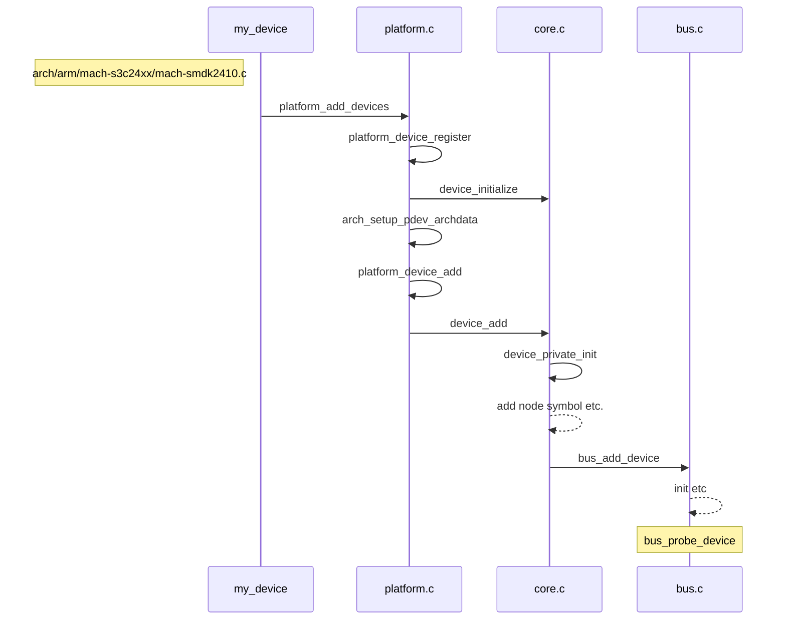
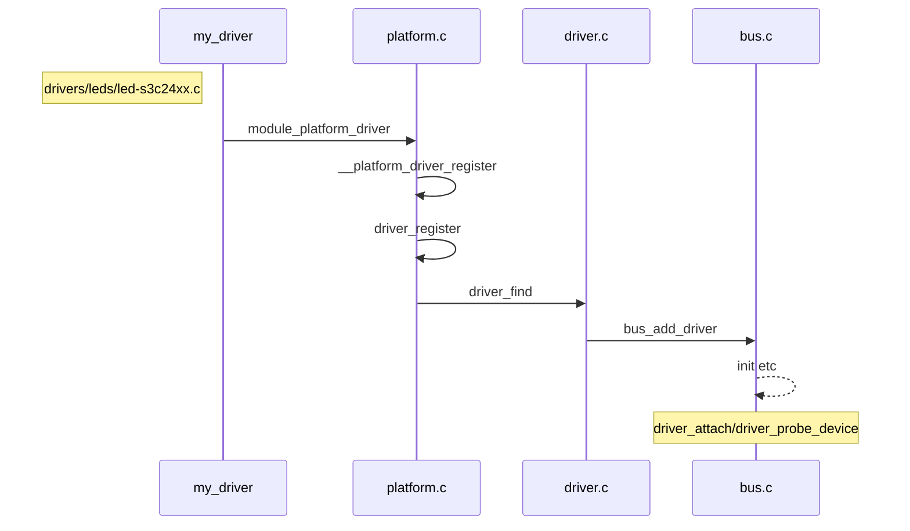
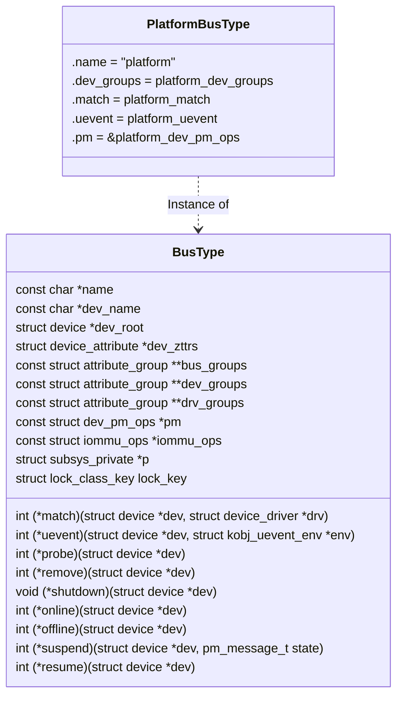
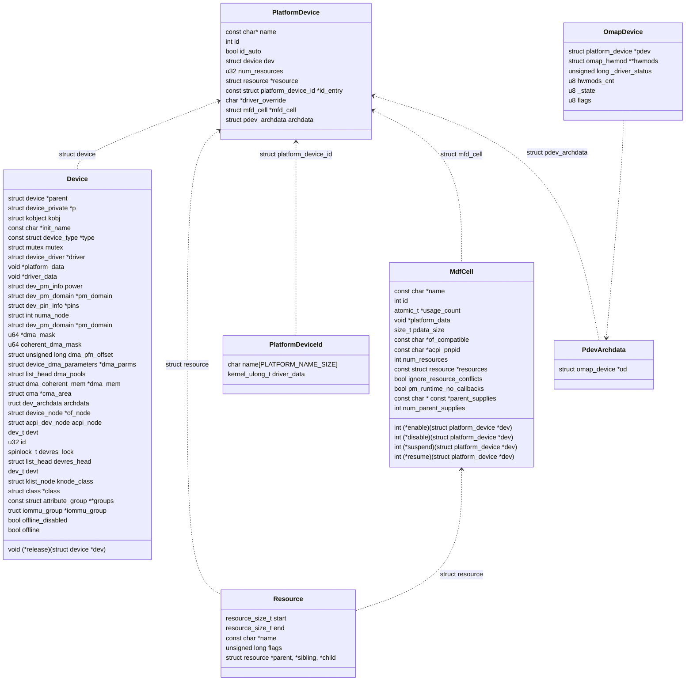
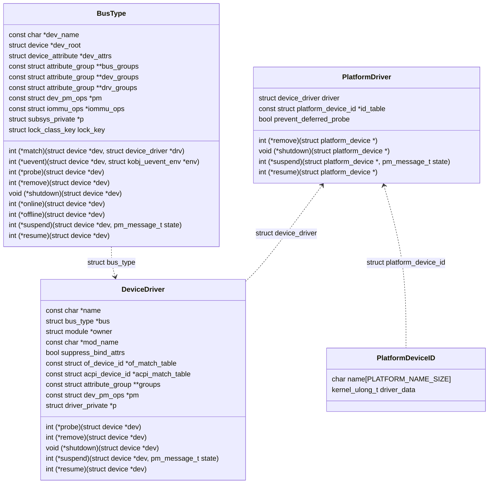
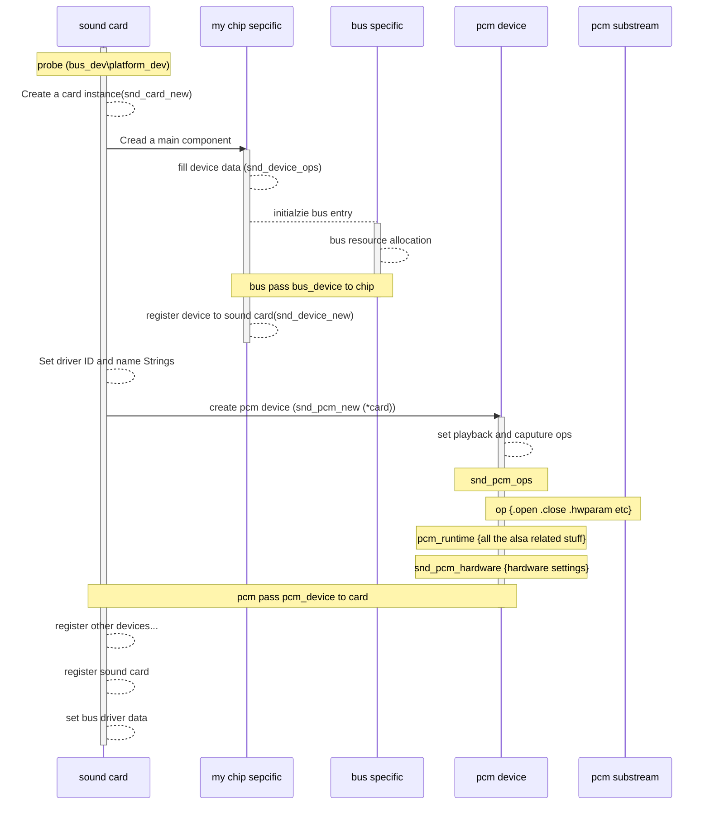
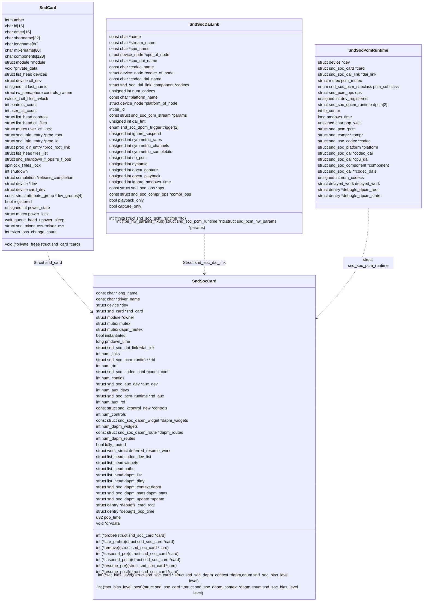
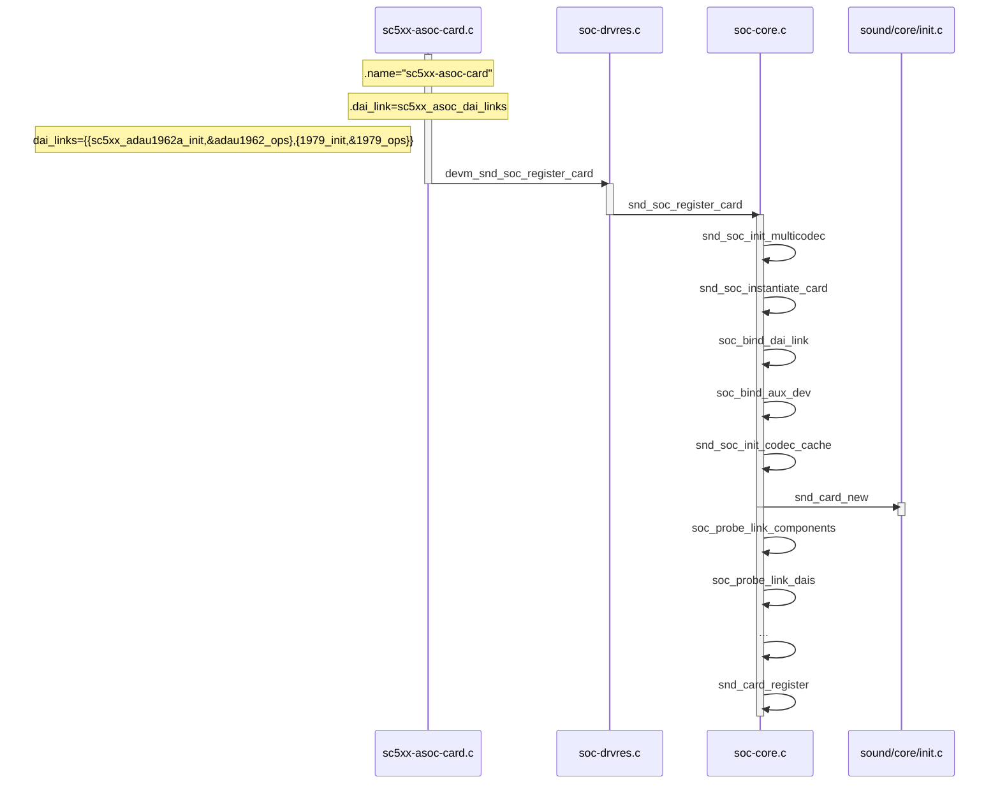

# ALSA ASoC Driver

本文档用于讲解ALSA中ASOC部分的程序实现


## 序

​	在DSP开发中，大多数情况的DSP并不使用任何操作系统，即No-OS的应用居多，尤其以安全性能需求最为突出的汽车应用，更是如此。大多数的汽车应用，更倾向于使用MCU+DSP的架构。但随着车机科技的进步，车机的计算能力正在超越其他ECU部件飞速发展。在可预见的几年内，车机的APP开发将是汽车行业的新的增长点。许多非安全功能出于成本的考虑，将向车机集成。

​	在此大背景下，对于声学从业人员，掌握车机Linux音频架构是非常有必要的。在国内，车机基于Android开发将是未来主流，而Android的底层的Kernel部分为Linux，音频相关的驱动也是基于Linux开发。学习Linux ALSA Driver的重要性也就呼之欲出了。

​	大多数情况我们不需要学习ALSA driver的开发，因为通常芯片厂商已经提供了成套的源代码供使用，只需要使用`ALSA-lib`中的API即可。但学习ALSA driver可以更好的让我们理解Linux ALSA的架构。


## Platform Device & Driver

​	在介绍ALSA 驱动之前，*Platform Device* 和 *Platform Driver*的注册过程需要详细了解。声卡驱动注册和初始化的过程中，基本都是基于Platform Device。这与**《Linux设备驱动开发》**一书中简单的char device不同，自2.6内核后，Linux驱动程序中大量的使用了`platform_device`、`platform_ driver` 和 `device`、 `bus`、 `driver`的方式对设备和驱动进行管理。`platform device`主要针对soc设备等带有外设的场景，由于许多SoC带有音频外设，所以许多设备，尤其是移动设备的ALSA中大量使用了`platform device`和 `platform driver`，我们以最常用的S3C6410开发板中的platform_LED为例，介绍Platform device driver的注册和配对过程，下面的顺序图分别从`platform device` 和 `platform driver`的角度，列出了其从创建和匹配到`probe`的过程。






​	从上述的注册过程，在各个device或driver挂载到对应的`bus`上之后，便会调用对应的`probe`函数。这里需要展开讨论两个小点：

- bus

- probe

  

### bus

​	通常的设备，都是通过总线挂载到MCU上，如`I2C`、`SPI`、`PCI`等，对于我们关心声卡设备，很多Codec设备也是通过I2C或SPI总线挂在MCU上。

- 这里的挂载，主要指的是控制总线挂载在上述的总线上。数据通常不是通过上述总线控制的

为了使得代码有更好的内聚性和模块适用性，对于哪些本身具有一些功能的，以音频为例，本身就能输出模拟音频或数字音频的，不需要经过上述的总线对输出进行控制。有鉴于此，Linux采用了一种`Platform bus`的方式对配置等过程进行了抽象分隔，使得原来的`device`和`driver`的程序逻辑仍然能够保持一致。下图列出了`bus_type`以及`platform_bus_type`的数据结构，可见`platform_bus_type`只是`name = "platform"`的总线结构。



### probe

probe函数的调用在一开始的流程图中，有所显示。以driver为例，其attach 函数如下

```c
static int __driver_attach(struct device *dev, void *data)
{
	struct device_driver *drv = data;

	/*
	 * Lock device and try to bind to it. We drop the error
	 * here and always return 0, because we need to keep trying
	 * to bind to devices and some drivers will return an error
	 * simply if it didn't support the device.
	 *
	 * driver_probe_device() will spit a warning if there
	 * is an error.
	 */

	if (!driver_match_device(drv, dev))
		return 0;

	if (dev->parent)	/* Needed for USB */
		device_lock(dev->parent);
	device_lock(dev);
	if (!dev->driver)
		driver_probe_device(drv, dev);
	device_unlock(dev);
	if (dev->parent)
		device_unlock(dev->parent);

	return 0;
}
```

对于platform device match函数有一系列的match方法，而name的match仅仅是最后一个通用选项。

```c
static int platform_match(struct device *dev, struct device_driver *drv)
{
	struct platform_device *pdev = to_platform_device(dev);
	struct platform_driver *pdrv = to_platform_driver(drv);

	/* When driver_override is set, only bind to the matching driver */
	if (pdev->driver_override)
		return !strcmp(pdev->driver_override, drv->name);

	/* Attempt an OF style match first */
	if (of_driver_match_device(dev, drv))
		return 1;

	/* Then try ACPI style match */
	if (acpi_driver_match_device(dev, drv))
		return 1;

	/* Then try to match against the id table */
	if (pdrv->id_table)
		return platform_match_id(pdrv->id_table, pdev) != NULL;

	/* fall-back to driver name match */
	return (strcmp(pdev->name, drv->name) == 0);
}
```

​	不管是device还是driver在attach之前，都会先调用函数将drv或dev挂载到bus上，这样就回答了，在device初始化时，没有任何driver挂载在bus上。对于driver，在`bus_add_driver`函数中：

```c
	klist_add_tail(&priv->knode_bus, &bus->p->klist_drivers)
  if (drv->bus->p->drivers_autoprobe) {
	error = driver_attach(drv);
	if (error)
		goto out_unregister;
	}
```

​	当probe完成后，device和driver的配对就完成了，用户可以通过driver的方法去实现相应的功能。	

​	下面列举了，platform_device 和 platform driver的数据结构





​	从上述的数据结构可以看到，对应platform相关的resource相关代码，全部涵盖在device中，而driver，依赖probe函数，完成与device的配对后，即可通过方法，控制deivce中的寄存器等资源。


## ALSA


### ALSA驱动层


#### generic ALSA driver

​	ALSA驱动的部分，可以参照Linux [官方的文档](https://www.kernel.org/doc/html/v4.15/sound/kernel-api/writing-an-alsa-driver.html)。以经常使用的PCM设备为例，声卡驱动创建主要的流程均可以用下面的流程图来表示。

​	通常由于音频都是经过解码后的pcm裸流混音后输出的，即多个`pcm_substream`合成一个`pcm_stream`。所以通常来说对具体音频流数据的操作函数，都在`pcm_substream`中定义。



#### ASoC ALSA Driver

​	与挂载在外设总线的音频设备不同，由于外设音频上的音频设备很多进行了ASIC封装，所以可以省去很多代码；而SoC（或者原先挂载在外设总线上的SoC），则需要对其中的音频接口`DAI`、音频接口数据`DMA`进行说明。另外由于SoC通用性，与其相连接的Codec芯片，其配置代码也可以进行一般化。所以在ASoC的ALSA驱动代码中，相较普通的ALSA驱动多了如下几个重要部分：

- DAI外设口设置如（SPort与SAI）

- DMA（DAI）

- Codec外设总线（I2C、SPI）
  - 由于Codec内部有很多控制Codec行为的寄存器，ALSA中讲一组特定的作用与Codec的总线指令，抽象为`DAPM`

  ~~ASoC 的描述~~
  
  ```mermaid
  sequenceDiagram
  participant machine as ASoC Machine
  participant codec as ASoC Codec
  participant pcm as ASoC PCM
  participant dai as ASoC DAI
  
  note over machine:Card define {.dai_link}
  note over machine: dailink{.codec_name .platform_name .init .ops}
  
  note over codec:register bus
  note over codec:register bus_driver
  
  note over pcm:define snd_pcm_ops
  note over pcm:register platform device (snd_soc_platform_driver)
  
  machine-->machine:register sound soc card (platform device)
  machine-->machine:init card lists:card->codec_dev_list,widgets,paths,dapm
  machine-->machine:alloc dai_link spaces
  machine-->machine:instantiate card,bind dai links
  
  codec->>machine:bind codec for snd_soc_pcm_runtime
  pcm->>machine:bind dai(platform) snd_soc_pcm_runtime
  
  machine-->machine:probe codec,platform 
  machine->>pcm:add new pcm
  
  
  
  
  
  
  ```
  
  

## ALSA-ASOC

​	ALSA是Advanced Linux Sound Architecture的缩写，高级[Linux](https://baike.baidu.com/item/Linux/27050)声音架构的简称,它在Linux操作系统上提供了音频和MIDI（Musical Instrument Digital Interface，音乐设备数字化接口）的支持。

​	而对于嵌入式系统来说，犹如`platform_device` 一般，Linux将一般设备的snd_card结构进行封装，并且将实现进行抽象，将`asoc`分成`mach`、`platform`、`codec`三层。其中`platform`和`codec`层不包含策略，具体的匹配通常都在`mach`层中确定。

- mach通常代指某款确定的板子
- platform通常代指某款MCU或DSP，主要由三部分组成
  - DMA驱动
  - DAI驱动
  - DSP驱动
- codec为MCU或DSP的外设解码器，主要包括：
  - DAI、PCM设置
  - codec 控制 （利用RegMap API）
  - 混音器与音频控制
  - DAPM描述信息
  - DAPM事件控制器

下图为snd_soc_card的数据结构，除了`snd_card`外，还包含`snd_soc_dai_link`和`snd_soc_pcm_runtime`两个重要的数据结构。



### ASOC初始化过程

我们以ADI 的SC573 ezkit的声卡注册为例，下图为`snd_soc_card`的初始化和注册过程,其中有大量的`platform_driver`和`platform_device` 的使用。


