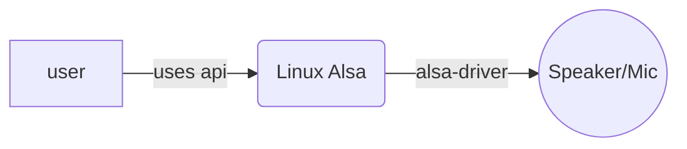
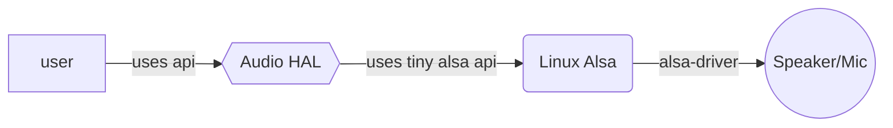
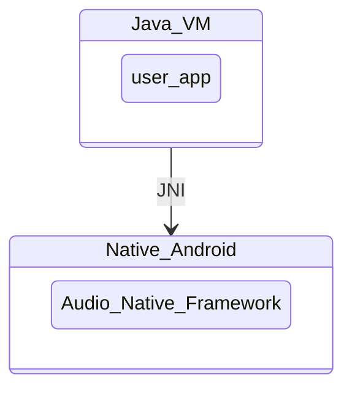
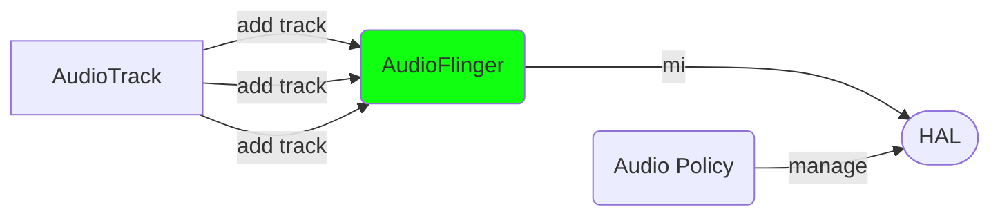
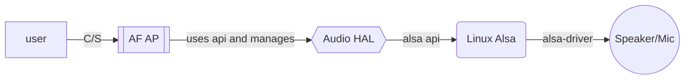
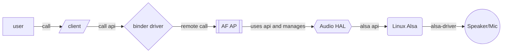
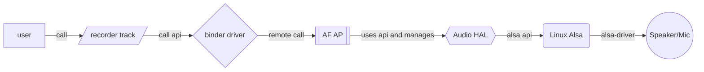
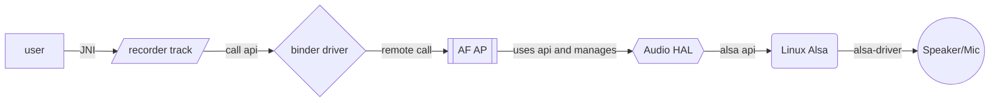

# Android音频框架

2021.05.19

Sheng Zhang


## 综述与导引

​	Android音频子系统，是目前嵌入式开源系统中最复杂的音频系统。利用Android音频框架，用户可以：

- 有效得管理多个、多种的音频播放设备，如模拟扬声器、蓝牙音频、usb音频设备、midi设备等。
- 有效得管理多种音频场景，如接打电话，播放音乐，播放蓝牙音频等。
- 有效得管理多种音效，如回响消除、声音均衡等。

​	

​	Android音频系统作为Android的重要子系统之一，其主要构成可以参照Android系统框架分为如下几个部分：

- Application Framework **应用层框架**  *provided by Google* 
  - 用户在此层利用Java或kotlin语言基于应用层框架提供的API，基于Android应用层组件编写运行在Java虚拟机上层的软件。
- JNI Java **原生接口层** *provided by Google*
  - 此层为上层接口（Java）调用Android底层（c/c++）的接口层
- Native Framework **原生框架** *provided by Google*
  - 上层Java接口的底层实现c/c++层
- Binder IPC **进程间调用** *provided by Google*
  - Android进程间调用层
- Media Server **媒体服务层** *provided by Google*
  - Android媒体服务框架层
- HAL **硬件抽象层** *provided by **vendor***
  - Android调用驱动硬件的抽象层
- Linux Kernel **内核驱动程序** *provided by **silicon vendors***
  - 硬件驱动程序

​	

​	除了与芯片、硬件有关的部分（主要为驱动、以及驱动对应的HAL）需要芯片厂商和硬件厂商提供，软件部分的主要开发多由google AOSP提供。最终Android设备厂商需要对源码、硬件抽象和驱动进行修改，进而完成开发，针对我们研究的音频部分，与音频有关的上述框架主要代码如下图所示：


​	

​	上述的音频分层分类，无论在google的AOSP项目，还是各大博客论坛的帖子中均有广泛的提及，也是我们分析Android音频的主要线索。由于音频框架代码量相对较多，许多博客都是以代码分析为主，但由于Android 音频系统的复杂性，很难有博客主对所有的代码业务进行分析，通常是看到哪块分析哪块，而分析到后期，觉得入门了便沉浸到业务代码中去，导致整个博客系列断更。本文聚焦重要的概念。除了本文外，还可以参考此博客，[博客的内容相对全面](https://strayinsights.blogspot.com/)（可能需要翻墙）。

​	在我们分析具体代码时，我们需要首先分析整个框架的整体逻辑，也就是本章节的主要内容，而后，再对典型过程进行分析，如初始化；某个音频的全过程分析等进行具体分析。

​	介于本文的读者通常为我司人员，通常具有一定的固件知识和算法知识，对于软件工程知之甚少，采用自下而上的分析方法，能够更容易理解一些。由于软件工程需要一定的抽象，我们在分析时牢记两个分析抓手：

  1. **每一层为上一层提供了什么接口**？
  2. **每一层在本层主要进行了什么工作，如何利用其下一层提供的接口**？

​	下面我们将结合Android音频框架，从底层往顶层进行代码逻辑梳理。


## Linux Kernel

​	Linux内核是近代最伟大的计算机内核之一，该内核简洁优美、又具备极好的扩展性，使其被广泛应用于移动、服务器端，Android也借用了此内核，进行内存管理、任务切换等工作 。这里我们需要树立一个基本的观念，并不是操作系统越复杂，方案就越好。操作系统的选择，通常需要根据我们具体的应用来选择，如：

- 对于一些简单功能的音频程序，可能并不需要复杂的操作系统，有时甚至不需要任何操作系统。
- 对于稍微复杂一些的音频程序，可能只需要有限状态机加上数字音频接口**(DAI)**辅之以**DMA**即可。
- 再复杂一些的，如除了音频任务外，还需要进行一些诊断任务的，可能需要运行一个uc/os或者FreeRTOS的环境，以进行多任务切换，如音效功放中的并发线程的算法等。
- 对于更复杂的应用场景，尤其涉及复杂线程、复杂驱动、文件管理、内存管理等需求的场景时。虽然上述的实时操作系统（FreeRTOS、uc/os）也有对应的库来做此处提到的所有功能，但是对于多线程等复杂场景，易用性和鲁棒性都不高，Linux｜Android提供了一套完美的解决框架。


### Linux sound

​	在本文的聚焦的音频中，Linux目前的主要框架为[**ALSA**(*Advanced Linux Sound Architecture*)](https://www.alsa-project.org/wiki/Main_Page)，其中的Advanced是针对其前身的**OSS**而言的（具体Advanced在哪儿，暂时没有并未查到相关资料，似乎是OSS user space的崩溃有概率导致kernel space的崩溃，具体如何崩溃的未知）。**ALSA**框架主要分为下面三个方面：

- **User-Level Alsa-lib**：为应用程序提供调用ALSA Core的调用接口，如`pcm_open`、`pcm_write`用于打开pcm设备，并对该设备进行写操作（**ALSA维护者维护**）
- **ALSA/ASoC-Core** 为ALSA lib提供符合Linux操作系统规范的接口，用以调用底层驱动（**ALSA维护者维护**）
- **ALSA/ASoC Driver**  为ALSA Core提供硬件的打开与读写接口。（**硬件开发商开发**）


​	一个简单的基于Alsa-lib开发的程序如下方代码所示，用户利用ALSA-Lib接口，完成音频编程。下方代码描述了，如何利用ALSA 接口，发出白噪声，代码中以序号标出关键代码。

```c
#include "../include/asoundlib.h"
 
static char *device = "default";            /* playback device */
unsigned char buffer[16*1024];              /* some random data */
 
int main(void)
{
    int err;
    unsigned int i;
    snd_pcm_t *handle;
    snd_pcm_sframes_t frames;
 
    for (i = 0; i < sizeof(buffer); i++)
        buffer[i] = random() & 0xff;		/*1. gen write noise*/
 
  	/*2. open pcm device*/
    if ((err = snd_pcm_open(&handle, device, SND_PCM_STREAM_PLAYBACK, 0)) < 0) {
        printf("Playback open error: %s\n", snd_strerror(err));
        exit(EXIT_FAILURE);
    }
  
  	/*3. set pcm params*/
    if ((err = snd_pcm_set_params(handle,
                      SND_PCM_FORMAT_U8,
                      SND_PCM_ACCESS_RW_INTERLEAVED,
                      1,
                      48000,
                      1,
                      500000)) < 0) {   /* 0.5sec */
        printf("Playback open error: %s\n", snd_strerror(err));
        exit(EXIT_FAILURE);
    }
 
        for (i = 0; i < 16; i++) {
        /*4. pass white noise data to pcm device*/
        frames = snd_pcm_writei(handle, buffer, sizeof(buffer));
        if (frames < 0)
            frames = snd_pcm_recover(handle, frames, 0);
        if (frames < 0) {
            printf("snd_pcm_writei failed: %s\n", snd_strerror(frames));
            break;
        }
        if (frames > 0 && frames < (long)sizeof(buffer))
            printf("Short write (expected %li, wrote %li)\n", (long)sizeof(buffer), frames);
    }
 
    /* pass the remaining samples, otherwise they're dropped in close */
    err = snd_pcm_drain(handle);
    if (err < 0)
        printf("snd_pcm_drain failed: %s\n", snd_strerror(err));
    snd_pcm_close(handle);
    return 0;
}
```

1. 产生需要传入write接口的白噪声（此处为无符号8位整形，与3中一致）
2. 打开driver：通过Alsa core 打开ALSAdriver对应的虚拟文件
3. 设置驱动参数
4. 调用接口将数据通过文件读写的形式，写入驱动。


​	如上图所示，在Linux一切皆为文件的大指导思想下，ALSA的驱动在ALSA Core的作用下，最终注册为可读写的snd文件节点，用户通过调用封装好的ALSA-lib接口，进行音频的输入输出编程。

​	通常如果不需要Android的其他功能，只需要音频读写，那么只需要适配到这部分就可以了。因为在这一层已经对用户提了的ALSA-lib这样的API库以进行音频编程了。[ALSA的API](https://www.alsa-project.org/alsa-doc/alsa-lib/index.html)可参照此链接。并且不论是PCI板卡还是SoC，在ALSA-core和ALSA driver两层的适配下，alsa-lib具有统一的接口供用户使用。所以专业级声卡，适配到Linux的有很多。此外，ALSA除了常规的PCM(*PCM码流*)设备外，还支持MIDI，音序器，控制器等等。对于专业、单一的音频设备，采用Linux系统的ALSA框架，可以完成大多数的工作。

​	但ALSA也具有如下的主要缺点：

- 实时性欠佳，由于Linux是软实时的操作系统，虽然可以通过修改宏达到硬实时的效果，但对于强实时性要求的场合适配性不佳，通常需要对内核与系统了解较为深入的工程师才能充分利用该设置。
- 对于复杂场景的编程，对于应用工程师的要求较高。

​	回到Android音频系统本身，由于Android场景的特殊性，MIDI、音序器部分的功能，手机端并不需要支持，所以Android中ALSA的库删除了这些用不到的功能，并且将一些复杂的功能的实现也去掉了(*放在HAL中实现*)。Android中Linux ALSA 部分更名为tinyalsa(tiny也就算了，甚至都小写了)。

| ALSA                                                         | tinyalsa                                                     |
| ------------------------------------------------------------ | ------------------------------------------------------------ |
| Efficient support for all types of audio interfaces, from consumer sound cards to professional multichannel audio interfaces. * Fully modularized sound drivers. * SMP and thread-safe design (PLEASE READ THIS). * User space library (alsa-lib) to simplify application programming and provide higher level functionality. * Support for the older Open Sound System (OSS) API, providing binary compatibility for most OSS programs. | Provide a basic pcm and mixer API. *If it's not absolutely needed, don't add it to the API. • Avoid supporting complex and unnecessary operations that could be dealt with at a higher levelProvide a basic pcm and mixer API to implement the Audio HAL (Hardware Abstract Level) for Android platform. |

​	除了ALSA库的不同外，由于Android也不是一个主打实时性的平台，而是主打复杂性的平台。对于音频来说，Android可以看作是一个特殊的ALSA应用。并且由Google完成了复杂的软件分层，为用户提供了一个复杂音频场景的基本框架。


### 小结

本小节介绍了Android音频运行的Linux Kernel中的音频ALSA框架：Android的底层内核是Linux、利用了Linux的任务管理、内存管理等功能。音频底层也是沿用了Linux的ALSA框架：

- ALSA驱动照抄但有侧重
  - Android 移动设备特别注重节能这部分，并且通常都为SoC方案，对应ALSA-ASoC驱动部分，但基本更强调DAPM (Dyamic Audio Power Management)
- ALSA Core 进行了删简
- ALSA-Lib 应用接口也进行了删简

​	通常情况下，我们并不需要对ALSA Core或者ALSA-Lib、tinyalsa进行修改，除非我们维护内核、或者维护ALSA。通常需要我们进行修改、适配的通常是ASoC驱动。ASoC驱动将在专门的文章中进行分解。

**Linux Kernel tinyalsa框架，主要给Android 驱动上层提供了一个硬件：读、写的接口**，Android系统对于音频而言，为一个特殊的应用对音频硬件进行管理。目前概念图如下：




## HAL(Hardware abstract Layer)

​	为了统一的管理Android的所有类型的硬件（音频硬件、显示硬件、相机、触摸等），Android引入了硬件抽象层，用统一的API接口，对这些硬件进行访问。以我们上文的Linux ALSA程序为类比，HAL的地位相当于是ALSA App，即，基于ALSA 驱动、ALSA Core、ALSA lib接口编写的音频程序，为Android上层提供统一的API接口。通过硬件抽象层的引入：

- 可以统一的上层函数调用。针对每个种类的硬件，都可以用同样的形式对下进行访问。(HIDL)
- 对于确定的某个硬件，上层的服务层函数，可以通过保持连续的函数接口对下进行调用。

​	

​	此外，由于Linux 内核是开源代码，由于受开源协议，导致驱动程序通常情况将开源。但是HAL层本质上是一个App，所以即可以绕开驱动必须开源的窘境，由于Android系统的底层通过访问HAL层固定的接口，HAL层完全可以封装其对驱动的调用。一定程度上保证了Android硬件商的利益：**”黑科技不用开源了“**。

​	回到我们聚焦的Android音频部分，Android Audio HAL层主要分成两层：

- Audio device
  - AudioDevice HAL 
    - 打开输入输出音频流
    - 设置音频模式
  - AudioPolicy HAL
    - 打开、暂停输入输出 （设备）
    - 设置参数、音量
    - 打开提示音等
- Audio effect (audiofx)

下表列出了AudioDevice与AudioPolicy HAL层的主要的接口方法：

| AudioDevice ops                                              | AudioPolicyService ops                                       |
| ------------------------------------------------------------ | ------------------------------------------------------------ |
| + .. *get_supported_devices(...)<br/>+ .. *init_check(...)<br/>+ .. *set_voice_volume(...)<br/>+ .. *set_master_volume(...)<br/>+ .. *get_master_volume(...)<br/>+ .. *set_mode(...)<br/>+ .. *set_mic_mute(...)<br/>+ .. *get_mic_mute(...)<br/>+ .. *set_parameters(...)<br/>+ .. *get_parameters(...)<br/>+ .. *get_input_buffer_size(...)<br/>+ .. *open_output_stream(...)<br/>+ .. *close_output_stream(...)<br/>+ .. *open_input_stream(...)<br/>+ .. *close_input_stream(...)<br/>+ .. *get_microphones(...)<br/>+ .. *dump(...)<br/>+ .. *set_master_mute(...)<br/>+ .. *get_master_mute(...)<br/>+ .. *create_audio_patc(...)<br/>+ .. *release_audio_patch(...)<br/>+ .. *get_audio_port(...)<br/>+ .. *set_audio_port_config(...) | + .. *set_device_connection_state(...)<br/>+ .. *get_device_connection_state(...)<br/>+ .. *set_phone_state(...)<br/>+ .. *set_ringer_mode(...)<br/>+ .. *set_force_use(...)<br/>+ .. *get_force_use(...)<br/>+ .. *set_can_mute_enforced_audible(...)<br/>+ .. *init_check(...)<br/>+ .. *get_output(...)<br/>+ .. *start_output(...)<br/>+ .. *stop_output(...)<br/>+ .. *release_output(...)<br/>+ .. *get_input(...)<br/>+ .. *start_input(...)<br/>+ .. *stop_input(...)<br/>+ .. *release_input(...)<br/>+ .. *init_stream_volume(...)<br/>+ .. *set_stream_volume_index(...)<br/>+ .. *get_stream_volume_index(...)<br/>+ .. *set_stream_volume_index_for_device(...)<br/>+ .. *get_stream_volume_index_for_device(...)<br/>+ .. *get_strategy_for_stream(...)<br/>+ .. *get_devices_for_stream(...)<br/>+ .. *get_output_for_effect(...)<br/>+ .. *register_effect(...)<br/>+ .. *unregister_effect(...)<br/>+ .. *set_effect_enabled(...)<br/>+ .. *is_stream_active(...)<br/>+ .. *is_stream_active_remotely(...)<br/>+ .. *is_source_active(...)<br/>+ .. *dump(...)<br/>+ .. *is_offload_supported(...) |

​	对于上面几个HAL Device的介绍会放在后续单独章节中介绍，此处可以略加观察，并记住以下的几个接口函数：

- Audio Device (stream 操作)
  - `open_output_stream`
  - `open_input_stream`
- Audio Policy（音频逻辑、设备打开）
  - `set_force_use`
  - `start_output`
  - `start_input`

​	此外，通常这一层的程序均由硬件厂商提供。硬件厂商通过实现上述几个HAL的接口，完成Audio部分的HAL层编程。


### 小结

​	本小节主要介绍了HAL层，这一层的本质是在tinyalsa+linux kernel+驱动上实现的音频应用。除去Audio effect外，该音频应用也被分为了两个部分，一个用于管理音频设备的打开关闭，另一个对每个设备的音频流进行管理。更加严格的说法应该是，一个提供了音频设备打开关闭等的硬件管理接口、另一个提供了音频流的硬件管理接口。至此，一个android设备，硬件层面已经完成了对上层的接口开放。目前概念图如下：




## Media Server

​	在经历了Linux Kernel，ALSA，和HAL之后，与芯片硬件相关的部分暂时告一段落。此时已经完成了对硬件访问的前期开发工作,提供了Android系统需要的接口访问。此时真正Android系统的开发开始了。

​	对于Android应用来说，Android App运行在Java虚拟机上，Java层的代码显然无法直接调用完全由c/c++开发的内核和HAL层接口。完成Java和c/c++的调用，需要通过**JNI**层(Java用于调用原生c/c++)。




​	本章节主要介绍Android Native层。

​	虽然通过JNI层后，系统可以直接调用c/c++接口了，但是每个java层程序直接访问硬件是非常不推荐的。如多路音频同时对单一的接口进行访问，即使是充分考虑的竞态，在多种音频同时播放时，必然也是满是pop音。所以，必须采用c/s架构，统一的由一个或者多个线程管理上述的接口。而客户端用于为java层跨过JNI后提供对server的访问。


​	在linux系统中，不同进程出于进程安全的考虑，进程间是不能进行直接通讯的，进程间通讯（IPC）需要基于一些特殊的机制。Android主要采用的是Binder驱动的方式进行IPC。可以说整个Android系统是基于Binder驱动搭建起来的。


​	本章主要介绍的是对HAL进行管理的两个最主要的Server进程。AudioFlinger和AudioPolicy Service，以下简称AF与AP。虽然高内聚，低耦合的开发规范在程序开发界被广泛采纳，但是AF与AP并不是完全解耦的。AF与AP的分工，与我们在HAL层中涉及的Audio Device HAL与Audio Policy HAL的分工类似。并且AF与AP实际上就是对上述的两个HAL层进行管理的两个server进程。

| Audio Flinger | Audio Policy Service     |
| ------------- | ------------------------ |
| 音频流管理    | 设备管理、音量焦点等管理 |

​	以Audio Flinger为例，其底层维护了一个Mixer线程，该线程将注册到AudioFlinger中的所有Track对象进行混音，然后访问HAL接口，进行输出。这样就避免了访问冲突，录音也是同理。



### 小结

​	本部分介绍了Android Media Server层的由来：系统采用CS架构，对音频流进行管理。其中的CS架构中的Server层即对应本小节的主体：Media Server。AF与AP是Android Media Server层的主要组成部分，具体的介绍需要在后面的具体章节中对这两个进程的初始化，API函数进行展开讨论。目前概念图如下：



## Binder IPC

​	Android 开发必被问到的面试问题之一，因为`Binder`实在是太重要了。详细的讲解会在后面的章节中介绍。通过上面章节的介绍。目前Audio部分我们完成了如下的工作：

- 有一个通用的驱动对硬件进行访问
- 有个抽象层对驱动进行调用，并且提供稳定的接口供上方调用
- 有一个服务器层通过混音线程对抽象层进行管理


​	此时，我们需要的便是客户端层。通过客户端层对服务器层的调用，即可完成音频的编程。**但是**，Linux进程间是隔离的，客户端层是无法直接调用服务器层的函数的。所以需要采用一种机制去高效的进行进程间通讯。

​	Linux为IPC提供了如下的接口：

- PIPE
- FIFO
- Message Queue


`Binder`不是Linux原生的IPC方式，[之所以被Android选中](https://www.zhihu.com/question/39440766/answer/89210950)，主要是由于其的进程间通讯的高效，稳定等优点。在binder驱动注册完成后，client端可以像运行本地函数接口一般运行server端的函数。`binder`的介绍会放在后续的子专题中进行介绍。目前概念图如下：




## Native Framework

​	行文至此，已经基本完成了大部分的准备工作。此层为客户端层的原生层，即c++代码为主的客户端底层代码。该层通过对底层音频客户端进行调用，可以完成底层的音频逻辑。Android底层主要将音频分为`recorder`和`track`两类，一类用于收，一类用于发。

​	此层，主要为客户端层代码，包含大量的逻辑型代码。在后续代码分析中再进行分析。目前概念图如下：



## JNI

​	JNI 接口，供Java调用原生层的c/c++代码，对于音频主要为调用底层的audio track和audio recorder。将上文中的逻辑图，加入JNI的部分后：



## Application Framework

​	此层为最后的Java层的API接口，供开发者进行开发使用。除了与底层对应的audio recorder和audio track外。还提供了一些整体的封装，如mediaplayer类的player类，供用户使用。

​	由于是API接口，并且为用户层的接口，至Java层，API函数已经大大缩少。以AudioTrack.Java中提供的接口为例，到此层，基本只需要下述几类接口：

- 带参初始化
- write
- getstatus 查询状态

​	Application Framework为用户提供了简单，易用的函数接口。而一系列底层，又为这些易用的函数接口提供了鲁棒性。以AudioTrack的使用为例，主要代码部分如下：

```java
mAudioTrack = new AudioTrack.Builder().setAudioAttributes(new AudioAttributes.Builder()
                            .setUsage(AudioAttributes.USAGE_MEDIA)
                            .setContentType(AudioAttributes.CONTENT_TYPE_MUSIC)
                            .setLegacyStreamType(AudioManager.STREAM_MUSIC)
                            .build())
                    .setAudioFormat(new AudioFormat.Builder()
                            .setEncoding(AUDIO_FORMAT)
                            .setSampleRate(SAMPLE_RATE)
                            .setChannelMask(CHANNEL)
                            .build())
                    .setTransferMode(AudioTrack.MODE_STREAM)
                    .setBufferSizeInBytes(mBufferSizeInBytes)
                    .build();
            mAudioTrack.play();
            while ((len = dis.read(bytes)) != -1 && mStatus == Status.STATUS_START) {
                mAudioTrack.write(bytes, 0, len);
            }
```

​	由之前的整个过程可以知道，鲁棒性是由代码量，和代码逻辑分层来保证的。每一层为上一层提供数量较少，可靠，稳定的接口。虽然至此Java层完成了对底层所有函数过程的封装，实现了对音频的操作，但是Java层函数也仅仅只是上层复杂，稳定java层应用的接口。Android复杂的应用编程由此展开。


